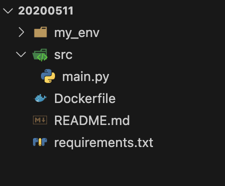

# 20200511
Repository of SENECHAL-Morgan-M1-APP-BDML

# DEVOPS - TP1: Docker

## Objectives
- Create a GitHub repository named after your EFREI identifier.
- Develop a wrapper that retrieves the weather for a given location using its latitude and longitude (passed as environment variables), utilizing the OpenWeather API. You may use the programming language of your choice (bash, python, go, nodejs, etc.).
- Package your code in a Docker image.
- Publish your Docker image on DockerHub.
- Make your code accessible in a GitHub repository.

## Deliverables

1. Public GitHub repository URL containing the Dockerfile and wrapper code.
2. Public DockerHub registry URL where your Docker image is hosted.
3. A report detailing your technical choices, commands used, and challenges faced if the task wasn't completed. This report should be emailed no later than 48 hours after the TP ends to the professor's email with the subject: `[TP1-DEVOPS] LAST NAME FIRST NAME`.

## Grading Criteria

- Code availability on GitHub.
- A Dockerfile that successfully builds.
- Docker image availability on DockerHub.
- Functionality of the API, verifiable by running the following command with your Docker image:

docker run --env LAT="31.2504" --env LONG="-99.2506" --env API_KEY=****yourregistry/api:1.0.0


## Bonus Points

Earn bonus points for:

- No CVEs (Common Vulnerabilities and Exposures) as reported by `trivy`:

trivy image yourregistry/api:1.0.0

- No lint errors in the Dockerfile as reported by `hadolint`:

docker run --rm -i hadolint/hadolint < Dockerfile

- Ensuring no sensitive data (e.g., OpenWeather API key) is stored within the image.

## Report

Introduction:

Dans le cadre de l'approfondissement des compétences en DevOps, ce travail pratique numero 1 vise à illustrer l'intégration continue et le déploiement continu (CI/CD) en utilisant des outils modernes et des pratiques innovantes. L'objectif est de créer une application simple mais fonctionnelle qui interroge l'API OpenWeather pour obtenir des informations météorologiques basées sur des coordonnées géographiques fournies. Ce processus comprend la création d'un répertoire GitHub personnalisé, le développement d'un wrapper dans le langage de programmation de notre choix, et l'encapsulation de l'application dans une image Docker pour assurer la portabilité et la facilité de déploiement. Enfin, cette image sera publiée sur DockerHub, rendant notre travail accessible et réutilisable par la communauté. Ce projet met en lumière l'importance de l'automatisation et des bonnes pratiques de développement dans le paysage technologique actuel, soulignant l'essence même des principes DevOps.

Architecture: 

Pour répondre au besoin de ce projet, j'ai décidé d'utilisé l'architecture ci dessous: 



"my_env": Cette espace nous permet de crée un environement virtuel nous permettant d'y ajouter toutes les library nécéssaire pour notre application.

"src": Cette espace est utilisé pour stocké notre script python "main.py" contenant le wrapper de notre application.

"Dockerfile": Ce script docker nous permet d'inséré toutes les instructions pour construire notre image Docker, y compris la base de l'image python, l'installation des dépendances à partir de notre "requirements.txt", et la commande pour exécutert notre script python. 

"requirements": Ce fichier text nous permet d'ajouté tout les dépendances nécéssaires à notre application.

Code: 

Wrapper:

Ce script Python sert de wrapper pour l'API OpenWeather. Il permet de récupérer les informations météorologiques actuelles pour une localisation spécifiée par latitude et longitude.
 
Importation des modules

```python
import os
import requests
```

os : Ce module fournit une manière portable d'utiliser les fonctionnalités dépendantes du système d'exploitation, comme lire ou écrire dans des variables d'environnement.
requests : Un module externe qui facilite l'envoi de requêtes HTTP. Il est nécessaire de l'installer via pip.

Variables d'environnement

```python
LATITUDE = os.getenv('LATITUDE')
LONGITUDE = os.getenv('LONGITUDE')
API_KEY = os.getenv('OPENWEATHER_API_KEY')
```

Ces lignes récupèrent les valeurs des variables d'environnement pour la latitude, la longitude, et la clé API d'OpenWeather. Utiliser des variables d'environnement pour ces informations sensibles aide à sécuriser le code.

URL de base de l'API

```python
BASE_URL = "http://api.openweathermap.org/data/2.5/weather"
```

Définit l'URL de base pour accéder à l'API météo d'OpenWeather.

Fonction get_weather

```python
def get_weather(latitude, longitude, api_key):
```

Cette fonction fait la requête à l'API OpenWeather pour obtenir les données météorologiques basées sur la latitude et la longitude fournies.

Construction de la requête

```python
params = {
    'lat': latitude,
    'lon': longitude,
    'appid': api_key,
    'units': 'metric'  # ou 'imperial' pour Fahrenheit
}
response = requests.get(BASE_URL, params=params)
```
Les paramètres nécessaires pour la requête API sont définis, puis une requête GET est envoyée. units='metric' indique que la température sera en degrés Celsius.

Vérification de la réponse

```python
response.raise_for_status()
```

Cette méthode lève une exception si la requête échoue, permettant au script de gérer l'erreur plutôt que de continuer avec une réponse invalide.

Traitement de la réponse

```python
data = response.json()
weather_description = data['weather'][0]['description']
temperature = data['main']['temp']
city = data['name']
country = data['sys']['country']
print(f"La météo à {city}, {country} est : {weather_description} avec une température de {temperature}°C.")
```

Convertit la réponse en JSON, puis extrait et affiche la description de la météo, la température, le nom de la ville, et le code du pays.

Gestion des erreurs

```python
except requests.exceptions.HTTPError as err:
    print(f"Erreur lors de la récupération des données météo : {err}")
except Exception as e:
    print(f"Une erreur est survenue : {e}")
```

Gère les éventuelles erreurs HTTP ou autres exceptions qui pourraient survenir pendant la requête.

Point d'entrée principal

```python
if __name__ == "__main__":
    if LATITUDE and LONGITUDE and API_KEY:
        get_weather(LATITUDE, LONGITUDE, API_KEY)
    else:
        print("Les variables d'environnement LATITUDE, LONGITUDE, et OPENWEATHER_API_KEY sont requises.")
```

Vérifie si les variables nécessaires sont définies avant d'exécuter la fonction get_weather. Si elles ne le sont pas, un message d'erreur est affiché.


Test:

Conclusion:


