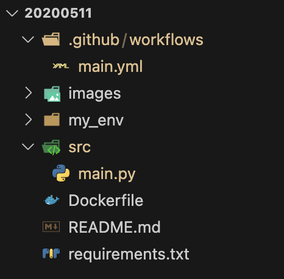
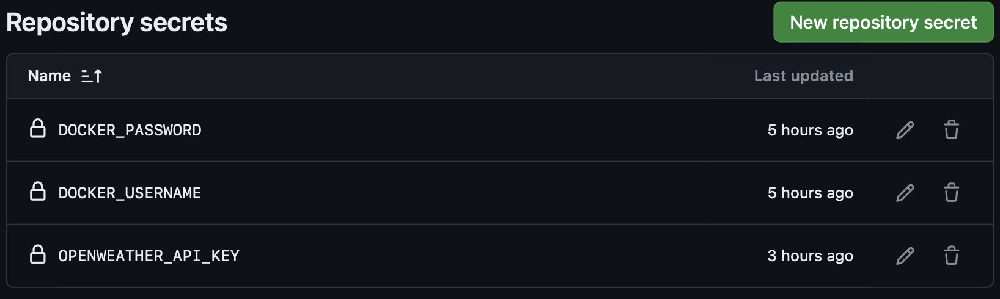
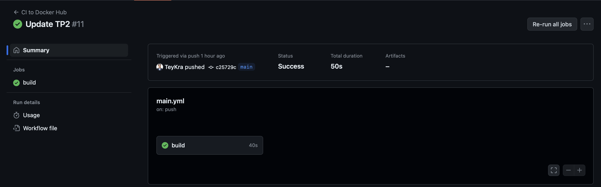
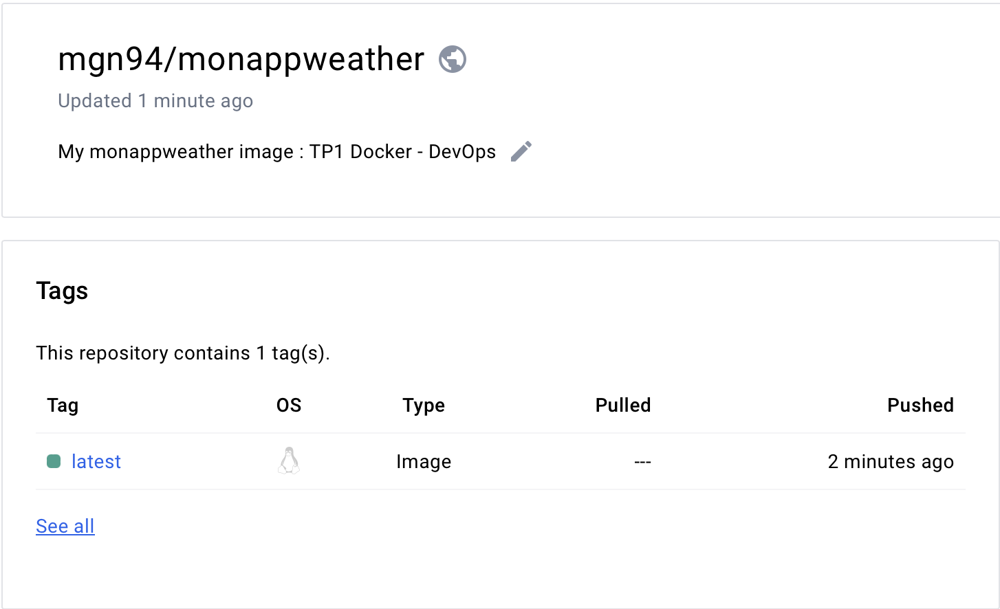
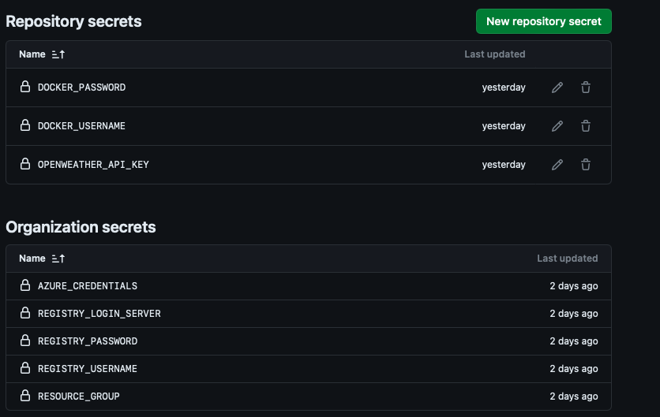
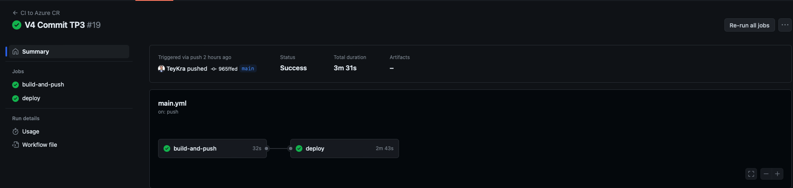
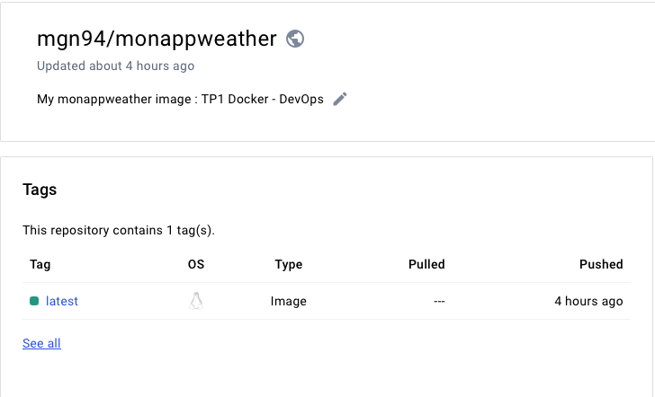
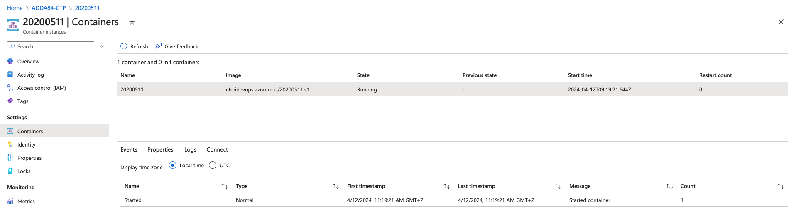

# 20200511
Repository of SENECHAL-Morgan-M1-APP-BDML

# DEVOPS - TP1: Docker

## Objectives
- Create a GitHub repository named after your EFREI identifier.
- Develop a wrapper that retrieves the weather for a given location using its latitude and longitude (passed as environment variables), utilizing the OpenWeather API. You may use the programming language of your choice (bash, python, go, nodejs, etc.).
- Package your code in a Docker image.
- Publish your Docker image on DockerHub.
- Make your code accessible in a GitHub repository.

## Deliverables

1. Public GitHub repository URL containing the Dockerfile and wrapper code.
2. Public DockerHub registry URL where your Docker image is hosted.
3. A report detailing your technical choices, commands used, and challenges faced if the task wasn't completed. This report should be emailed no later than 48 hours after the TP ends to the professor's email with the subject: `[TP1-DEVOPS] LAST NAME FIRST NAME`.

## Grading Criteria

- Code availability on GitHub.
- A Dockerfile that successfully builds.
- Docker image availability on DockerHub.
- Functionality of the API, verifiable by running the following command with your Docker image:

docker run --env LAT="31.2504" --env LONG="-99.2506" --env API_KEY=****yourregistry/api:1.0.0


## Bonus Points

Earn bonus points for:

- No CVEs (Common Vulnerabilities and Exposures) as reported by `trivy`:

trivy image yourregistry/api:1.0.0

- No lint errors in the Dockerfile as reported by `hadolint`:

docker run --rm -i hadolint/hadolint < Dockerfile

- Ensuring no sensitive data (e.g., OpenWeather API key) is stored within the image.

# DevOps Skills Enhancement Project - CI/CD with OpenWeather API

## Introduction

In the quest to deepen DevOps skills, Practical Work #1 aims to showcase Continuous Integration and Continuous Deployment (CI/CD) using modern tools and innovative practices. The goal is to develop a simple yet functional application that queries the OpenWeather API for weather information based on provided geographical coordinates. This process includes creating a custom GitHub repository, developing a wrapper in the programming language of our choice, and encapsulating the application in a Docker image to ensure portability and ease of deployment. Finally, this image will be published on DockerHub, making our work accessible and reusable by the community. This project highlights the significance of automation and good development practices in today's tech landscape, underscoring the core principles of DevOps.

## Architecture

To meet the project's requirements, the following architecture has been employed:

### Components

- **`my_env`**: A virtual environment to include all necessary libraries for our application.
- **`src`**: The space used to store our Python script `main.py`, containing our application's wrapper.
- **`Dockerfile`**: This Docker script contains all the instructions to build our Docker image, including the base image of Python, installing dependencies from our `requirements.txt`, and the command to execute our Python script.
- **`requirements`**: A text file to list all the necessary dependencies for our application : **`requests`**

### Diagram

Below is the general structure of our project's architecture:


## Code

### Wrapper `main.py`

- This Python script serves as a wrapper for the OpenWeather API. It retrieves current weather information for a location specified by latitude and longitude.
  
#### Importing modules

```python
import os
import requests
```

- **`os`** : This module provides a portable way to use operating system-dependent functionality, such as reading or writing environment variables.
requests: An external module that facilitates sending HTTP requests. It needs to be installed via pip.

#### Environment variables

```python
LATITUDE = os.getenv('LATITUDE')
LONGITUDE = os.getenv('LONGITUDE')
API_KEY = os.getenv('OPENWEATHER_API_KEY')
```

- These lines retrieve the values of the environment variables for latitude, longitude, and the OpenWeather API key. Using environment variables for this sensitive information helps secure the code.
  
#### Base URL of the API

```python
BASE_URL = "http://api.openweathermap.org/data/2.5/weather"
```

- Set the base URL to access the OpenWeather API.
  
#### Function get_weather

```python
def get_weather(latitude, longitude, api_key):
```

- This function makes the request to the OpenWeather API to obtain weather data based on the provided latitude and longitude.

#### Building the request

```python
params = {
    'lat': latitude,
    'lon': longitude,
    'appid': api_key,
    'units': 'metric'  
}
response = requests.get(BASE_URL, params=params)
```
- The necessary parameters for the API request are defined, then a GET request is sent. units='metric' indicates that the temperature will be in Celsius degrees.
  
#### Response verification

```python
response.raise_for_status()
```

- This method raises an exception if the request fails, allowing the script to handle the error rather than proceeding with an invalid response.
  
#### Processing the response

```python
data = response.json()
weather_description = data['weather'][0]['description']
temperature = data['main']['temp']
city = data['name']
country = data['sys']['country']
print(f"La météo à {city}, {country} est : {weather_description} avec une température de {temperature}°C.")
```

- Convert the response to JSON, then extract and display the weather description, temperature, city name, and country code.
  
#### Error handling

```python
except requests.exceptions.HTTPError as err:
    print(f"Erreur lors de la récupération des données météo : {err}")
except Exception as e:
    print(f"Une erreur est survenue : {e}")
```

- Handle any potential HTTP errors or other exceptions that may occur during the request.

#### Main entry point

```python
if __name__ == "__main__":
    if LATITUDE and LONGITUDE and API_KEY:
        get_weather(LATITUDE, LONGITUDE, API_KEY)
    else:
        print("Les variables d'environnement LATITUDE, LONGITUDE, et OPENWEATHER_API_KEY sont requises.")
```

- Check if the necessary variables are defined before executing the get_weather function. If they are not, an error message is displayed.

### Dockerfile `Dockerfile`

- This Dockerfile creates a Docker image for our Python weather application, using a minimal base image to reduce potential vulnerabilities.
  
#### Base image

```dockerfile
FROM python:3.9-alpine
```

- **`python:3.9-alpine`** : Use a lightweight version of a Python image based on Alpine Linux. Alpine is chosen for its small size and increased security.

#### Working directory

```dockerfile
WORKDIR /app
```

- **`WORKDIR /app`** : Sets /app as the working directory in the container. Subsequent commands will be executed in this directory.
  
#### Installing dependencies

```dockerfile
RUN apk add --no-cache build-base libffi-dev
```

- **`apk add --no-cache build-base libffi-dev`** : Install the necessary packages to compile certain Python dependencies. **`build-base`** includes compilation tools, and **`libffi-dev`** is often required for packages needing extensions.

#### Installing Python packages

```dockerfile
COPY requirements.txt ./
RUN pip install --no-cache-dir -r requirements.txt
```

- Copy **`requirements.txt`** in the container, install the specified Python dependencies. Using **`--no-cache-dir`**  helps reduce the image size by avoiding storing the pip cache.

#### Copying the source code

```dockerfile
COPY src/ ./
```

- Copy the files from the source directory src/ to the working directory /app in the container. This includes the Python script and any other files necessary for running the application.

#### Environment variable for the API key

```dockerfile
ENV OPENWEATHER_API_KEY=""
```

- Set an environment variable **`OPENWEATHER_API_KEY`** that will be used by the application. The actual value of the API key should be provided at runtime, ensuring that the Docker image remains secure.

```dockerfile
CMD ["python", "./main.py"]
```

- **`CMD ["python", "./main.py"]`** : Set the default command to execute the application, launching main.py with Python. This command is executed when the container starts, unless a different command is specified at container startup.

## Test

### Wrapper

#### Definition of LATITUDE and LONGITUDE

- To configure an application or script that requires specific environment variables, such as latitude and longitude for our weather application, we can set them directly from our .**`zsh`** terminal. 

##### Input

```shell
export LATITUDE=48.8566
export LONGITUDE=2.3522
export OPENWEATHER_API_KEY=YOUR_KEY
```

##### Output

```shell
La météo à Paris, FR est : light rain avec une température de 8.66°C.
```

- The tests for our wrapper work as expected.

### Dockerfile

#### Build the Docker image

##### Input

```shell
docker build -t monappweather:latest .
```

##### Output

```shell
[+] Building 1.4s (12/12) FINISHED                                                                           docker:desktop-linux
 => [internal] load build definition from Dockerfile                                                                         0.0s
 => => transferring dockerfile: 812B                                                                                         0.0s
 => [internal] load metadata for docker.io/library/python:3.9-alpine                                                         1.3s
 => [auth] library/python:pull token for registry-1.docker.io                                                                0.0s
 => [internal] load .dockerignore                                                                                            0.0s
 => => transferring context: 2B                                                                                              0.0s
 => [1/6] FROM docker.io/library/python:3.9-alpine@sha256:99161d2323b4130fed2d849dc8ba35274d1e1f35da170435627b21d305dad954   0.0s
 => [internal] load build context                                                                                            0.0s
 => => transferring context: 106B                                                                                            0.0s
 => CACHED [2/6] WORKDIR /app                                                                                                0.0s
 => CACHED [3/6] RUN apk add --no-cache build-base libffi-dev                                                                0.0s
 => CACHED [4/6] COPY requirements.txt ./                                                                                    0.0s
 => CACHED [5/6] RUN pip install --no-cache-dir -r requirements.txt                                                          0.0s
 => CACHED [6/6] COPY src/ ./                                                                                                0.0s
 => exporting to image                                                                                                       0.0s
 => => exporting layers                                                                                                      0.0s
 => => writing image sha256:eb12932e8ad14e7fd2c29d78a58fb2903d2e394058a8f1899447892e26607dea                                 0.0s
 => => naming to docker.io/library/monappweather:latest                                                                      0.0s

View build details: docker-desktop://dashboard/build/desktop-linux/desktop-linux/poofijn3hkuosv7f0niyf7g3t

What's Next?
  View a summary of image vulnerabilities and recommendations → docker scout quickview
```

#### Validation of the Dockerfile and the image

##### Input

```shell
docker run --rm -i hadolint/hadolint < Dockerfile
```

##### Output

```shell
-:8 DL3018 warning: Pin versions in apk add. Instead of `apk add <package>` use `apk add <package>=<version>`
```

- No errors were encountered: 0 lint errors on Dockerfile (hadolint)

#### Scan vulnerabilities with Trivy

##### Input

```shell
trivy image monappweather:latest
```

##### Output

```shell
2024-03-31T00:26:53.204+0100    INFO    Need to update DB
2024-03-31T00:26:53.204+0100    INFO    DB Repository: ghcr.io/aquasecurity/trivy-db:2
2024-03-31T00:26:53.204+0100    INFO    Downloading DB...
44.66 MiB / 44.66 MiB [-------------------------------------------------------------------------------] 100.00% 11.17 MiB p/s 4.2s
2024-03-31T00:26:58.860+0100    INFO    Vulnerability scanning is enabled
2024-03-31T00:26:58.860+0100    INFO    Secret scanning is enabled
2024-03-31T00:26:58.860+0100    INFO    If your scanning is slow, please try '--scanners vuln' to disable secret scanning
2024-03-31T00:26:58.860+0100    INFO    Please see also https://aquasecurity.github.io/trivy/v0.50/docs/scanner/secret/#recommendation for faster secret detection
2024-03-31T00:26:58.891+0100    INFO    Detected OS: alpine
2024-03-31T00:26:58.891+0100    INFO    Detecting Alpine vulnerabilities...
2024-03-31T00:26:58.896+0100    INFO    Number of language-specific files: 1
2024-03-31T00:26:58.896+0100    INFO    Detecting python-pkg vulnerabilities...

monappweather:latest (alpine 3.19.1)

Total: 0 (UNKNOWN: 0, LOW: 0, MEDIUM: 0, HIGH: 0, CRITICAL: 0)

2024-03-31T00:26:58.898+0100    INFO    Table result includes only package filenames. Use '--format json' option to get the full path to the package file.

Python (python-pkg)

Total: 2 (UNKNOWN: 0, LOW: 0, MEDIUM: 1, HIGH: 1, CRITICAL: 0)

┌───────────────────────┬────────────────┬──────────┬────────┬───────────────────┬───────────────┬──────────────────────────────────────────────────────────┐
│        Library        │ Vulnerability  │ Severity │ Status │ Installed Version │ Fixed Version │                          Title                           │
├───────────────────────┼────────────────┼──────────┼────────┼───────────────────┼───────────────┼──────────────────────────────────────────────────────────┤
│ pip (METADATA)        │ CVE-2023-5752  │ MEDIUM   │ fixed  │ 23.0.1            │ 23.3          │ pip: Mercurial configuration injectable in repo revision │
│                       │                │          │        │                   │               │ when installing via pip                                  │
│                       │                │          │        │                   │               │ https://avd.aquasec.com/nvd/cve-2023-5752                │
├───────────────────────┼────────────────┼──────────┤        ├───────────────────┼───────────────┼──────────────────────────────────────────────────────────┤
│ setuptools (METADATA) │ CVE-2022-40897 │ HIGH     │        │ 58.1.0            │ 65.5.1        │ pypa-setuptools: Regular Expression Denial of Service    │
│                       │                │          │        │                   │               │ (ReDoS) in package_index.py                              │
│                       │                │          │        │                   │               │ https://avd.aquasec.com/nvd/cve-2022-40897               │
└───────────────────────┴────────────────┴──────────┴────────┴───────────────────┴───────────────┴──────────────────────────────────────────────────────────┘
```

- Regarding vulnerabilities on our selected image  **`python:3.9-alpine`**,  we can see here that we have no critical vulnerabilities: **`Total: 2 (UNKNOWN: 0, LOW: 0, MEDIUM: 1, HIGH: 1, CRITICAL: 0)`**


#### Run the Docker container

##### Input

```shell
docker run --rm -e OPENWEATHER_API_KEY=b022acb509eacae0875ded1afe41a527 -e LATITUDE=31.2504 -e LONGITUDE=99.2506 monappweather  
```

##### Output

```shell
La météo à Ganzi, CN est : overcast clouds avec une température de -2.91°C.
```

#### Publish the image on Docker Hub.

##### Create an account on Docker Hub

- Link : https://hub.docker.com

#### Log in to Docker Hub from the terminal

##### Input

```shell
docker login
```

##### Output

```shell
Authenticating with existing credentials...
Login Succeeded
```

#### Tag the image

```shell
docker tag monappweather:latest mgn94/monappweather:latest
```

#### Push the image to Docker Hub

```shell
docker push mgn94/monappweather:latest
```

- We can find our image on Docker Hub : https://hub.docker.com/repository/docker/mgn94/monappweather/general

#### No sensitive data in the image

- In the completion of this TP1, we took steps to ensure that no sensitive data, such as our OpenWeather API key, was stored in the Docker image. It is a good security practice to ensure that all sensitive data are provided via environment variables at the time of container execution.

## Conclusion

In conclusion, this DevOps TP1 demonstrated an effective application of continuous integration and deployment (CI/CD) principles through the creation of a Dockerized weather application. By focusing on essential DevOps skills, such as automation, security, and accessibility, this work led to the successful implementation of a software solution that queries the OpenWeather API for weather data based on geographical coordinates. The challenges encountered, particularly in managing vulnerabilities and securing sensitive data, were carefully addressed, reinforcing the importance of good development and security practices in today's technological ecosystem. The success of this project is illustrated not only by the functionality of the application but also by its public availability on DockerHub, thereby encouraging sharing and reuse within the DevOps community.

# DEVOPS - TP2: Github Action

## Objectives

- Configure a GitHub Actions workflow
- Transform a wrapper into an API
- Automatically publish to Docker Hub on each push
- Make the image (API format) available on DockerHub
- Make the code available in a GitHub repository

## Grading Criteria

- Code available on Github
- GitHub action that builds and pushes the image on each new commit
- Docker image available on DockerHub
- API that returns the weather using the following command using the image:
  
```shell
docker run --network host --env API_KEY=**** maregistry/efrei-devops-tp2:1.0.0
```

puis dans un autre terminal

```shell
curl "http://localhost:8081/?lat=5.902785&lon=102.754175"
```

## Bonus

- Add hadolint to Github workflow before build+push and failed on errors
- Aucune données sensibles stockées dans l'image ou le code source (i.e: openweather API key, Docker hub credentials)

# DevOps Application Deployment Project - Automated API Service with Docker and GitHub Actions

## Introduction

In continuation of deepening DevOps skills, Practical Work #2 is designed to highlight the advanced features of Continuous Integration and Continuous Deployment (CI/CD) through the use of GitHub Actions. The goal of this practical work is to transform a wrapper into a functional API that interacts with the OpenWeather service to obtain weather information via provided geographical coordinates. This project involves setting up a GitHub Action workflow that automates the building and pushing of the Docker image with each commit. The code will be hosted in a dedicated GitHub repository, while the API will be encapsulated in a Docker image to ensure its portability and ease its deployment. The final image will be published on DockerHub, making our work accessible and reusable by the community. This practical work underscores the importance of automation and efficient development practices in today's technological landscape, thereby reaffirming the fundamental principles of DevOps.

## Architecture

To meet the project's requirements, the following architecture has been employed:

### Components

We will maintain the same architecture as in Practical Work #1, adding the configuration file for the GitHub Action:

- **`main.yml`** in the folder **`.github/workflows`** is used to configure GitHub Actions, automating tasks such as compiling, testing, and deploying our code in response to specific events such as pushes or pull requests.

### Diagram

Below is the general structure of our project's architecture:



## Implementation Steps

Same implementation as Practical Work #1 except that we are adding : `.github / workflows`:


## GitHub repository secret



Here we have 3 repository secrets allowing us to contain sensitive information corresponding to the DockerHub credentials and the secret access key for the OpenWeather API.

## Code

### Explanation of the Flask Code for the Weather API (`main.py`)

This Flask code creates a simple API that retrieves weather information for specific geographic coordinates using the OpenWeather API.

#### Importation des Modules

```python
from flask import Flask, request, jsonify
import os
import requests
```

-**`Flask`** : The code is used to create the web application.
-**`request`** : To access the parameters of the HTTP request.
-**`jsonify`** : To format the response into JSON.
-**`os`** : To access environment variables.
-**`requests`** : To make HTTP requests to the external OpenWeather API.

#### Flask Application Initialization

```python
app = Flask(__name__)
```

- Creates an instance of the Flask application.

#### Route and Processing Function Definition

```python
@app.route('/')
def get_weather():
```

- Defines a root route (/) that responds to GET requests.

#### Retrieving Parameters and API Key

```python
    latitude = request.args.get('lat')
    longitude = request.args.get('lon')
    api_key = os.getenv('OPENWEATHER_API_KEY')
```

- Retrieves latitude and longitude from the parameters of the HTTP request.
- Retrieves the API key for the OpenWeatherMap API from the environment variables.

#### Checking for Parameter Presence

```python
    if not all([latitude, longitude, api_key]):
        return "Les variables d'environnement LATITUDE, LONGITUDE, et OPENWEATHER_API_KEY sont requises.", 400
```

- Checks if all necessary parameters are present. If not, returns an error message with HTTP code 400 (Bad Request).

#### Construction de la Requête à l'API OpenWeatherMap

```python
    BASE_URL = "http://api.openweathermap.org/data/2.5/weather"
    params = {
        'lat': latitude,
        'lon': longitude,
        'appid': api_key,
        'units': 'metric'
    }
    response = requests.get(BASE_URL, params=params)
```

- Sets the base URL for the API.
- Prepares the parameters for the request.
- Sends the request to the OpenWeatherMap API.

#### Processing the API Response

```python
    if response.status_code == 200:
        data = response.json()
        weather_description = data['weather'][0]['description']
        temperature = data['main']['temp']
        return jsonify({
            "city": data['name'],
            "country": data['sys']['country'],
            "weather_description": weather_description,
            "temperature": temperature
        })
    else:
        return jsonify({"error": "Failed to fetch weather data"}), response.status_code
```

- If the response is successful, extracts and returns the weather data.
- In case of failure, returns an error message and the corresponding HTTP status code.

#### Starting the Application

```python
if __name__ == '__main__':
    app.run(host='0.0.0.0', port=8081)
```

- Ensures that the Flask server starts only if the script is executed directly.
- Configures the server to listen on all network interfaces (useful for Docker containers).

## Explanation of the Dockerfile for the Weather API (`Dockerfile`)

This Dockerfile sets up a Docker environment for deploying a Flask application that queries the OpenWeather API.

### Using a Base Image 

```dockerfile
FROM python:3.9-alpine
```

- Use the `python:3.9-alpine` image as the base. This image is based on Alpine Linux, which is known for its lightweight nature and security, minimizing vulnerabilities.

### Defining the Working Directory

```dockerfile 
WORKDIR /app
```

- Set `/app` as the working directory inside the container. All subsequent commands will be executed in this directory.

### Installing System Dependencies

```dockerfile 
RUN apk add --no-cache build-base=0.5-r3 libffi-dev=3.4.4-r3
```

- Install the necessary packages to compile certain Python packages that may have C components. `build-base` and `libffi-dev` are installed with fixed versions specifically to maintain reproducibility.

### Copying and Installing Python Dependencies

```dockerfile
COPY requirements.txt ./
RUN pip install --no-cache-dir -r requirements.txt
```

- Copy the `requirements.txt` file from the local directory to the working directory of the container.

- Execute `pip install` to install the Python packages listed in `requirements.txt` without caching the downloaded packages, thus reducing the size of the image.

### Copying Source Code Files

```dockerfile
COPY src/ ./
```

- Copy the source code files located in the `src` folder of the local directory to the working directory of the container.

### Defining Environment Variables

```dockerfile
ENV OPENWEATHER_API_KEY=""
ENV FLASK_APP=main.py
```

- Set `OPENWEATHER_API_KEY` as an environment variable with an empty default value. The actual API key will be passed at runtime, ensuring that sensitive data is not stored in the image.
- Set `FLASK_APP` to indicate to Flask which file to execute.

### Application Execution Command

```dockerfile
CMD ["flask", "run", "--host=0.0.0.0", "--port=8081"]
```

- Set the default command to execute the Flask application. The `--host=0.0.0.0` option allows the application to be accessible on all network interfaces of the container, and `--port=8081` specifies the port on which the application will be accessible.

## Explanation of the GitHub Actions File (`main.yml`)

This `main.yml` file defines a GitHub Actions workflow named "CI to Docker Hub," aimed at automating the building and publishing of a Docker image to Docker Hub whenever changes are pushed to the `main` branch.

### Workflow Triggers

```yaml
on:
  push:
    branches:
      - main
```

- This workflow is triggered by `push` events to the `main` branch.

### Workflow Jobs

#### Job build

```yaml
jobs:
  build:
    runs-on: ubuntu-latest
```

- Defines a job named `build` that runs on the latest available Ubuntu runner.

### Job Steps

#### Code Checkout

```yaml
- uses: actions/checkout@v2
```

- Use the `checkout@v2` action to clone the source code of the repository into the runner's environment.

#### Docker Buildx Configuration

```yaml 
- name: Set up Docker Buildx
  uses: docker/setup-buildx-action@v1
```

- Use `docker/setup-buildx-action@v1` to configure Docker Buildx, a Docker tool for building multi-architecture images.

#### Connecting to Docker Hub

```yaml
- name: Log in to Docker Hub
  uses: docker/login-action@v1
  with:
    username: ${{ secrets.DOCKER_USERNAME }}
    password: ${{ secrets.DOCKER_PASSWORD }}
```

- Use `docker/login-action@v1` to log in to Docker Hub using credentials stored as secrets in GitHub Actions.

#### Building and Publishing the Docker Image

```yaml
- name: Build and push Docker image
  uses: docker/build-push-action@v2
  with:
    context: .
    file: ./Dockerfile
    push: true
    tags: mgn94/monappweather:latest
  env:
    OPENWEATHER_API_KEY: ${{ secrets.OPENWEATHER_API_KEY }}
```

- Use `docker/build-push-action@v2` to build the Docker image from the specified Dockerfile and push it to Docker Hub with the `latest` tag.

- The OpenWeather API key is passed as an environment variable from GitHub secrets.

#### Linting the Dockerfile with Hadolint

```yaml
- name: Run Hadolint
  uses: hadolint/hadolint-action@v1.6.0
  with:
    dockerfile: Dockerfile
```

- Use `hadolint/hadolint-action@v1.6.0` to run Hadolint, which is a linter for Dockerfiles. This step ensures that the Dockerfile follows best practices.

## Explanation of the (`requirements.txt`) File

The `requirements.txt` file is used to manage dependencies for the Python project. It contains a list of external libraries that the application needs to function properly. 

### Dependencies

#### Flask

```plaintext
Flask
```

- **`Flask`**: This is a lightweight framework for developing web applications in Python. It's designed to make simple applications quickly and easily, with the ability to scale up to complex applications.

#### requests

```plaintext
requests
```

- **`requests`**: A library for sending HTTP/1.1 requests in Python. It's highly regarded for its simplicity and ease of use in performing tasks such as querying web APIs.

## Output

## Local Execution

##### Input

```shell
docker run --rm -e OPENWEATHER_API_KEY=b022acb509eacae0875ded1afe41a527 -e LATITUDE=31.2504 -e LONGITUDE=99.2506 monappweather
```

##### Output

```shell
La météo à Ganzi, CN est : broken clouds avec une température de -5.65°C.
```

#### API launch

##### Input

```shell
docker run -p 8081:8081 -e OPENWEATHER_API_KEY=$OPENWEATHER_API_KEY mgn94/monappweather:latest
```
##### Output

```shell 
 * Serving Flask app 'main.py'
 * Debug mode: off
WARNING: This is a development server. Do not use it in a production deployment. Use a production WSGI server instead.
 * Running on all addresses (0.0.0.0)
 * Running on http://127.0.0.1:8081
 * Running on http://172.17.0.2:8081
```

### Another Terminal (external to the IDE)

##### Input

```shell
curl "http://localhost:8081/?lat=40.7128&lon=-74.0060" 
```
##### Output

```shell
{"city":"New York","country":"US","temperature":10.38,"weather_description":"overcast clouds"}
```

##### Input

```shell
curl "http://localhost:8081/?lat=-33.8688&lon=151.2093" 
```

##### Output

```shell
{"city":"Sydney","country":"AU","temperature":15.39,"weather_description":"overcast clouds"}
```

##### Input

```shell
curl "http://localhost:8081/?lat=35.6895&lon=139.6917" 
```

##### Output

```shell
{"city":"Tokyo","country":"JP","temperature":15,"weather_description":"broken clouds"}
```

### Log Creation:

```shell
192.168.65.1 - - [11/Apr/2024 12:56:39] "GET /?lat=40.7128&lon=-74.0060 HTTP/1.1" 200 -
192.168.65.1 - - [11/Apr/2024 12:56:43] "GET /?lat=-33.8688&lon=151.2093 HTTP/1.1" 200 -
192.168.65.1 - - [11/Apr/2024 12:56:52] "GET /?lat=35.6895&lon=139.6917 HTTP/1.1" 200 -
```

### GitHub Action



### DockerHub



We can see that when we release a new version of our program to `github`, the `github action` starts loading to release the new version of our `docker image` to `Dockerhub`.

## Conclusion

In conclusion, this Practical Work #2 in DevOps effectively demonstrated the application of continuous integration and continuous deployment (CI/CD) principles through the development and deployment of a Dockerized API. By emphasizing essential DevOps skills such as automation, security, and accessibility, this work led to the successful implementation of a software solution that interacts with the OpenWeather API to retrieve weather data via geographical coordinates. Challenges encountered, particularly regarding the integration of quality controls and securing sensitive data through GitHub and DockerHub actions, were carefully managed, reinforcing the importance of rigorous development and security practices in the current technological ecosystem. The success of this project is demonstrated not only by the functionality of the API but also by its public availability on DockerHub, thereby promoting sharing and reuse within the DevOps community.

# DEVOPS - TP3: Cloud - ACI

## Objectives

- Make your code available in a Github repository.
- Make your API-formatted image available on Azure Container Registry (ACR) using Github Actions.
- Deploy on Azure Container Instance (ACI) using Github Actions.

## Github Organization Available Secrets

- **AZURE_CREDENTIALS**: Service account for authenticating with Azure API.
- **REGISTRY_LOGIN_SERVER**: Registry link (efreidevops.azurecr.io).
- **REGISTRY_USERNAME**: Username for the registry.
- **REGISTRY_PASSWORD**: Password for the registry.
- **RESOURCE_GROUP**: Azure resource group (ADDA84-CTP).

## Constraints

- **Location**: france central.
- **dns-name-label**: `devops-<identifiant-efrei>`.
- **Use the Github organization and its secrets**.
- **Azure Container Registry**: efreidevops.azurecr.io.
- **ACI Name**: EFREI identifier (example: 11002167).
- **ACR Repository Name**: EFREI identifier (example: efreidevops.azurecr.io/11002167:v1).

## Grading

- Code available on Github.
- Github action that builds and pushes the image to ACR with each new commit.
- Container deployed on Azure Container Instance.
- API that returns the weather using the following command:

```shell
curl "http://devops-<identifiant-efrei>.francecentral.azurecontainer.io/?
lat=5.902785&lon=102.754175"
```

## Bonus

- Use Prometheus libraries ([Prometheus](https://prometheus.io/docs/instrumenting/clientlibs/)) to expose an HTTP `/metrics` endpoint. Use a counter to represent the number of requests processed.

# DevOps API Service Automation Project - Deploying with Docker, GitHub Actions, and Azure

## Introduction

In continuation of deepening DevOps skills, Practical Work #3 is designed to explore advanced features of continuous integration and continuous deployment (CI/CD) through the use of GitHub Actions. The aim of this practical work is to deploy a functional API that interacts with the OpenWeather service to obtain weather information, automating the creation and deployment of its Docker image via GitHub Actions. The code will be hosted in a dedicated GitHub repository, while the API will be encapsulated in a Docker image stored in Azure Container Registry (ACR) to ensure its portability and facilitate deployment. The final image will then be deployed on an Azure Container Instance (ACI), making our work accessible and reusable within the community. This practical work highlights the importance of automation and effective development practices in the current technological landscape, thus reinforcing the fundamental principles of DevOps.

## Architecture

To meet the project's requirements, we will follow the same architecture used in TP2. However, modifications will be made to the workflow for ACR and the Python script `main.py` to implement the `/metrics` endpoint with Prometheus.

### Diagram


## GitHub repository secret



## Code

### Prometheus Implementation

This code snippet integrates Prometheus metrics into a Flask application, aimed at monitoring a simple API. 

#### Importing Necessary Modules

```python
from prometheus_flask_exporter import PrometheusMetrics
```

- **PrometheusMetrics**: This module is imported from the `prometheus_flask_exporter` library, which is used to expose Flask application metrics to Prometheus.

#### Application Setup

```python
app = Flask(__name__)
metrics = PrometheusMetrics(app)
```

- **app**: This initializes a new Flask application instance.
- **metrics**: This line attaches Prometheus metrics to the Flask app.

#### App Information Metric

```python
metrics.info('app_info', 'Weather API', version='1.0.0')
```

- This metric statically registers information about the application, such as the name ('Weather API') and its version ('1.0.0').

#### Request Counter

```python
request_counter = metrics.counter(
    'requests_by_type', 'Number of requests by type',
    labels={'endpoint': 'get_weather'}
)
```

- **request_counter**: This creates a counter metric named `requests_by_type`, which tracks the number of requests by type.
- **labels**: The counter is labeled with `endpoint` having the value `get_weather` to specify that the counts are for requests hitting the `get_weather` endpoint.

### Wrapper (`main.py`)

The rest of the wrapper code is the same as we did on TP2, here is the complete wrapper code with the prometheus implementation. We simply change the port `8081` to `80` and we will see why we make this choice later in the report.

```python
from flask import Flask, request, jsonify
import os
import requests
from prometheus_flask_exporter import PrometheusMetrics

app = Flask(__name__)
metrics = PrometheusMetrics(app)
metrics.info('app_info', 'Weather API', version='1.0.0')

# Compteur pour le nombre de requêtes traitées
request_counter = metrics.counter(
    'requests_by_type', 'Number of requests by type',
    labels={'endpoint': 'get_weather'}
)

# Définir la route racine qui réagira aux requêtes HTTP GET
@app.route('/')
def get_weather():
    # Récupérer les paramètres 'lat' (latitude) et 'lon' (longitude) de la requête HTTP
    latitude = request.args.get('lat')
    longitude = request.args.get('lon')
    # Récupérer la clé API de la variable d'environnement OPENWEATHER_API_KEY
    api_key = os.getenv('OPENWEATHER_API_KEY')

    # Vérifier si tous les paramètres nécessaires sont présents
    if not all([latitude, longitude, api_key]):
        # Si un paramètre est manquant, retourner un message d'erreur et un code de statut HTTP 400 (Bad Request)
        return "Les variables d'environnement LATITUDE, LONGITUDE, et OPENWEATHER_API_KEY sont requises.", 400

    # Définir l'URL de base pour l'API météo OpenWeatherMap
    BASE_URL = "http://api.openweathermap.org/data/2.5/weather"
    # Préparer les paramètres de la requête à envoyer à l'API OpenWeatherMap
    params = {
        'lat': latitude,
        'lon': longitude,
        'appid': api_key,
        'units': 'metric'  # Définir les unités en métrique (Celsius)
    }
    # Faire une requête GET à l'API OpenWeatherMap avec les paramètres spécifiés
    response = requests.get(BASE_URL, params=params)
    
    # Vérifier si la réponse est réussie (code de statut HTTP 200)
    if response.status_code == 200:
        # Convertir la réponse JSON en un dictionnaire Python
        data = response.json()
        # Récupérer la description de la météo et la température de la réponse
        weather_description = data['weather'][0]['description']
        temperature = data['main']['temp']
        # Retourner un JSON contenant les informations météo et un code de statut HTTP 200 (OK)
        return jsonify({
            "city": data['name'],  # Nom de la ville
            "country": data['sys']['country'],  # Code pays
            "weather_description": weather_description,  # Description de la météo
            "temperature": temperature  # Température actuelle
        })
    else:
        # Si la requête échoue, retourner un JSON contenant le message d'erreur et le code de statut HTTP de la réponse
        return jsonify({"error": "Failed to fetch weather data"}), response.status_code

# Point d'entrée du script, cela permet de lancer le serveur uniquement si le script est exécuté directement
if __name__ == '__main__':
    # Démarrer l'application Flask sur le port 80 accessible de l'extérieur
    app.run(host='0.0.0.0', port=80) 
```

### Dockerfile (`Dockerfile`)

In the `Dockerfile` we simply change the execution port of the application: `8081` to `80`:

```dockerfile
# Utiliser une image de base officielle Python Alpine pour minimiser les vulnérabilités
FROM python:3.9-alpine

# Définir le répertoire de travail dans le conteneur
WORKDIR /app

# Installer les dépendances nécessaires pour compiler certains packages de Python
RUN apk add --no-cache build-base=0.5-r3 libffi-dev=3.4.4-r3

# Copier le fichier des dépendances et installer les dépendances
COPY requirements.txt ./
RUN pip install --no-cache-dir -r requirements.txt

# Copier le reste des fichiers du code source de l'application dans le conteneur
COPY src/ ./

# Définir la variable d'environnement pour la clé API 
ENV OPENWEATHER_API_KEY=""
ENV FLASK_APP=main.py

# Commande pour exécuter l'application
CMD ["flask", "run", "--host=0.0.0.0", "--port=80"]
```

### GitHub Action: CI to Azure CR (`main.yml`)

We modified our main.yml for the new TP3 requirements: 
This GitHub Action is designed to automate the process of building a Docker image from the code pushed to the main branch, pushing it to Azure Container Registry (ACR), and then deploying it on Azure Container Instance (ACI). 

#### Workflow Trigger

```yaml
name: CI to Azure CR

on:
  push:
    branches:
      - main
```

- **Trigger**: This workflow is triggered on a push event specifically to the `main` branch of the repository.

#### Jobs

##### 1. Build and Push Image to ACR

```yaml
jobs:
  build-and-push:
    runs-on: ubuntu-latest
    steps:
    - uses: actions/checkout@v2
    - name: Set up Docker Buildx
      uses: docker/setup-buildx-action@v1
    - name: Log in to Azure Container Registry
      uses: docker/login-action@v1
      with:
        registry: ${{ secrets.REGISTRY_LOGIN_SERVER }}
        username: ${{ secrets.REGISTRY_USERNAME }}
        password: ${{ secrets.REGISTRY_PASSWORD }}
    - name: Build and push Docker image to ACR
      uses: docker/build-push-action@v2
      with:
        context: .
        file: ./Dockerfile
        push: true
        tags: ${{ secrets.REGISTRY_LOGIN_SERVER }}/20200511:v1
      env:
        OPENWEATHER_API_KEY: ${{ secrets.OPENWEATHER_API_KEY }}
    - name: Run Hadolint
      uses: hadolint/hadolint-action@v1.6.0
      with:
        dockerfile: Dockerfile
```

- **Environment**: This job runs on the latest Ubuntu runner.
- **Steps**:
  - **Checkout**: Checks out the repository code.
  - **Docker Buildx Setup**: Prepares Docker Buildx to build multi-architecture images.
  - **Docker Login**: Authenticates with Azure Container Registry using secrets configured in the GitHub repository.
  - **Build and Push**: Builds the Docker image from a Dockerfile and pushes it to ACR. The image is tagged with a specific version.
  - **Hadolint**: Links the Dockerfile using Hadolint to ensure best practices are followed.

##### 2. Deploy to Azure Container Instance

```yaml
  deploy:
    needs: build-and-push
    runs-on: ubuntu-latest
    steps:
    - name: Checkout code
      uses: actions/checkout@v2
    - name: 'Login via Azure CLI'
      uses: azure/login@v1
      with:
        creds: ${{ secrets.AZURE_CREDENTIALS }}
    - name: 'Deploy to Azure Container Instance'
      uses: azure/aci-deploy@v1
      with:
        resource-group: ADDA84-CTP
        dns-name-label: devops-20200511
        image: ${{ secrets.REGISTRY_LOGIN_SERVER }}/20200511:v1
        name: 20200511
        location: 'francecentral'
        registry-login-server: ${{ secrets.REGISTRY_LOGIN_SERVER }}
        registry-username: ${{ secrets.REGISTRY_USERNAME }}
        registry-password: ${{ secrets.REGISTRY_PASSWORD }}
        secure-environment-variables: OPENWEATHER_API_KEY=${{ secrets.OPENWEATHER_API_KEY }}
```

- **Dependencies**: This job depends on the successful completion of the `build-and-push` job.
- **Steps**:
  - **Checkout**: Re-checks out the code.
  - **Azure CLI Login**: Logs into Azure using the service principal credentials.
  - **Deploy**: Deploys the Docker image to an Azure Container Instance. The deployment uses details like resource group, DNS name label, and location, among others.

## Requirements File: `requirements.txt`

This file specifies the Python libraries required for the project. Compare to the previous TP, we just add the dependencies for the prometheus library.

### Dependencies

- **Flask**
  - **Purpose**: Flask is a lightweight WSGI web application framework. It is designed to make getting started quick and easy, with the ability to scale up to complex applications.

- **requests**
  - **Purpose**: Requests is an elegant and simple HTTP library for Python, built for human beings. It is used to make HTTP requests simpler and more human-friendly.

- **prometheus_flask_exporter**
  - **Purpose**: This library provides a Prometheus metrics exporter for Flask applications. It makes it easy to track application metrics directly from Flask.


## Output

### Local Execution 

###### Input

```shell
% python main.py
```

##### Output

```shell
 * Serving Flask app 'main'
 * Debug mode: off
WARNING: This is a development server. Do not use it in a production deployment. Use a production WSGI server instead.
 * Running on all addresses (0.0.0.0)
 * Running on http://127.0.0.1:80
 * Running on http://192.168.1.23:80
Press CTRL+C to quit
```

- We launch the main.py script to execute our API
- Now in another terminal, we can use curl to make some request on our API

##### Input

```shell 
curl "http://localhost:80/?lat=40.7128&lon=-74.0060" 
```

##### Output

```shell
{"city":"New York","country":"US","temperature":10.38,"weather_description":"overcast clouds"}
```

##### Input

```shell
curl "http://localhost:80/?lat=-33.8688&lon=151.2093" 
```

##### Output

```shell
{"city":"Sydney","country":"AU","temperature":15.39,"weather_description":"overcast clouds"}
```

##### Input

```shell
curl "http://localhost:80/?lat=35.6895&lon=139.6917" 
```

##### Output

```shell
{"city":"Tokyo","country":"JP","temperature":15,"weather_description":"broken clouds"}
```

### Prometheus metrics 

##### Input

```shell
curl http://127.0.0.1:8081/metrics
```

##### Output

```shell
# HELP python_gc_objects_collected_total Objects collected during gc
# TYPE python_gc_objects_collected_total counter
python_gc_objects_collected_total{generation="0"} 293.0
python_gc_objects_collected_total{generation="1"} 51.0
python_gc_objects_collected_total{generation="2"} 0.0
# HELP python_gc_objects_uncollectable_total Uncollectable objects found during GC
# TYPE python_gc_objects_uncollectable_total counter
python_gc_objects_uncollectable_total{generation="0"} 0.0
python_gc_objects_uncollectable_total{generation="1"} 0.0
python_gc_objects_uncollectable_total{generation="2"} 0.0
# HELP python_gc_collections_total Number of times this generation was collected
# TYPE python_gc_collections_total counter
python_gc_collections_total{generation="0"} 77.0
python_gc_collections_total{generation="1"} 6.0
python_gc_collections_total{generation="2"} 0.0
# HELP python_info Python platform information
# TYPE python_info gauge
python_info{implementation="CPython",major="3",minor="12",patchlevel="2",version="3.12.2"} 1.0
# HELP flask_exporter_info Information about the Prometheus Flask exporter
# TYPE flask_exporter_info gauge
flask_exporter_info{version="0.23.0"} 1.0
# HELP flask_http_request_duration_seconds Flask HTTP request duration in seconds
# TYPE flask_http_request_duration_seconds histogram
flask_http_request_duration_seconds_bucket{le="0.005",method="GET",path="/",status="200"} 0.0
flask_http_request_duration_seconds_bucket{le="0.01",method="GET",path="/",status="200"} 0.0
flask_http_request_duration_seconds_bucket{le="0.025",method="GET",path="/",status="200"} 0.0
flask_http_request_duration_seconds_bucket{le="0.05",method="GET",path="/",status="200"} 1.0
flask_http_request_duration_seconds_bucket{le="0.075",method="GET",path="/",status="200"} 2.0
flask_http_request_duration_seconds_bucket{le="0.1",method="GET",path="/",status="200"} 2.0
flask_http_request_duration_seconds_bucket{le="0.25",method="GET",path="/",status="200"} 3.0
flask_http_request_duration_seconds_bucket{le="0.5",method="GET",path="/",status="200"} 3.0
flask_http_request_duration_seconds_bucket{le="0.75",method="GET",path="/",status="200"} 3.0
flask_http_request_duration_seconds_bucket{le="1.0",method="GET",path="/",status="200"} 3.0
flask_http_request_duration_seconds_bucket{le="2.5",method="GET",path="/",status="200"} 3.0
flask_http_request_duration_seconds_bucket{le="5.0",method="GET",path="/",status="200"} 3.0
flask_http_request_duration_seconds_bucket{le="7.5",method="GET",path="/",status="200"} 3.0
flask_http_request_duration_seconds_bucket{le="10.0",method="GET",path="/",status="200"} 3.0
flask_http_request_duration_seconds_bucket{le="+Inf",method="GET",path="/",status="200"} 3.0
flask_http_request_duration_seconds_count{method="GET",path="/",status="200"} 3.0
flask_http_request_duration_seconds_sum{method="GET",path="/",status="200"} 0.2761303750012303
# HELP flask_http_request_duration_seconds_created Flask HTTP request duration in seconds
# TYPE flask_http_request_duration_seconds_created gauge
flask_http_request_duration_seconds_created{method="GET",path="/",status="200"} 1.712922281742592e+09
# HELP flask_http_request_total Total number of HTTP requests
# TYPE flask_http_request_total counter
flask_http_request_total{method="GET",status="200"} 3.0
# HELP flask_http_request_created Total number of HTTP requests
# TYPE flask_http_request_created gauge
flask_http_request_created{method="GET",status="200"} 1.7129222817427351e+09
# HELP flask_http_request_exceptions_total Total number of HTTP requests which resulted in an exception
# TYPE flask_http_request_exceptions_total counter
# HELP app_info Weather API
# TYPE app_info gauge
app_info{version="1.0.0"} 1.0
# HELP requests_by_type_total Number of requests by type
# TYPE requests_by_type_total counter
requests_by_type_total{endpoint="get_weather"} 0.0
# HELP requests_by_type_created Number of requests by type
# TYPE requests_by_type_created gauge
requests_by_type_created{endpoint="get_weather"} 1.712922256830365e+09
```

The output shows various metrics related to Python and Flask, as well as those specific to our application.

### Analysis of Main Metrics

- **`flask_http_request_total`**: This metric indicates the total number of HTTP requests processed by the application, with their method and status code. For example, `{method="GET",status="200"} 3.0` shows that we had 3 successful GET requests.

- **`flask_http_request_duration_seconds`**: This measures the duration of HTTP requests. Buckets show how many requests fall in each time interval, which is useful for analyzing endpoint performance.

- **`requests_by_type_total`**: Metric to count the number of requests by type, labeled by endpoint.

### Log Creation

```shell
127.0.0.1 - - [12/Apr/2024 13:44:41] "GET /?lat=40.7128&lon=-74.0060 HTTP/1.1" 200 -
127.0.0.1 - - [12/Apr/2024 13:44:53] "GET /?lat=-33.8688&lon=151.2093 HTTP/1.1" 200 -
127.0.0.1 - - [12/Apr/2024 13:45:04] "GET /?lat=35.6895&lon=139.6917 HTTP/1.1" 200 -
127.0.0.1 - - [12/Apr/2024 13:46:39] "GET /metrics HTTP/1.1" 200 -
```

- We can see log creation when we query our API

### GitHub Action AND Azur execution

### GitHub Action

- When we push our projet on our repository on github, the GitHub action start to build and push the last version of our image on DockerHub and Azure Container Registry.



- Here we can see that the build is completed. So now we can check if have an update on our Docker Hub and Azure Resource Group.

### DockerHub



- We can see that our image on DockerHub updated because of the new push of our project on our GitHub Repository.

### Azure Container Registry



- We can see that our resource has been uploaded to our resource group. This is implemented for use with curl for example.

### Cloud Request

Now, if we want to use our API from the image sent to the Azure cloud, we can use curl to do this:

#### Test the API Endpoint

##### Input

```shell
curl http://devops-20200511.francecentral.azurecontainer.io/
```

##### Output

```shell
Les variables d'environnement LATITUDE, LONGITUDE, et OPENWEATHER_API_KEY sont requises.
```

#### Test with Parameters

##### Input

```shell
curl "http://devops-20200511.francecentral.azurecontainer.io/?lat=48.8566&lon=2.3522"
```

##### Output

```shell
{"city":"Paris","country":"FR","temperature":21.49,"weather_description":"few clouds"}
```

#### Check Prometheus Metrics

##### Input

```shell
curl http://devops-20200511.francecentral.azurecontainer.io/metrics
```

##### Output

```shell
# HELP python_gc_objects_collected_total Objects collected during gc
# TYPE python_gc_objects_collected_total counter
python_gc_objects_collected_total{generation="0"} 2867.0
python_gc_objects_collected_total{generation="1"} 18.0
python_gc_objects_collected_total{generation="2"} 0.0
# HELP python_gc_objects_uncollectable_total Uncollectable objects found during GC
# TYPE python_gc_objects_uncollectable_total counter
python_gc_objects_uncollectable_total{generation="0"} 0.0
python_gc_objects_uncollectable_total{generation="1"} 0.0
python_gc_objects_uncollectable_total{generation="2"} 0.0
# HELP python_gc_collections_total Number of times this generation was collected
# TYPE python_gc_collections_total counter
python_gc_collections_total{generation="0"} 94.0
python_gc_collections_total{generation="1"} 8.0
python_gc_collections_total{generation="2"} 0.0
# HELP python_info Python platform information
# TYPE python_info gauge
python_info{implementation="CPython",major="3",minor="9",patchlevel="19",version="3.9.19"} 1.0
# HELP process_virtual_memory_bytes Virtual memory size in bytes.
# TYPE process_virtual_memory_bytes gauge
process_virtual_memory_bytes 3.8088704e+07
# HELP process_resident_memory_bytes Resident memory size in bytes.
# TYPE process_resident_memory_bytes gauge
process_resident_memory_bytes 3.0593024e+07
# HELP process_start_time_seconds Start time of the process since unix epoch in seconds.
# TYPE process_start_time_seconds gauge
process_start_time_seconds 1.71291356133e+09
# HELP process_cpu_seconds_total Total user and system CPU time spent in seconds.
# TYPE process_cpu_seconds_total counter
process_cpu_seconds_total 3.93
# HELP process_open_fds Number of open file descriptors.
# TYPE process_open_fds gauge
process_open_fds 8.0
# HELP process_max_fds Maximum number of open file descriptors.
# TYPE process_max_fds gauge
process_max_fds 1024.0
# HELP flask_exporter_info Information about the Prometheus Flask exporter
# TYPE flask_exporter_info gauge
flask_exporter_info{version="0.23.0"} 1.0
# HELP flask_http_request_duration_seconds Flask HTTP request duration in seconds
# TYPE flask_http_request_duration_seconds histogram
flask_http_request_duration_seconds_bucket{le="0.005",method="GET",path="/",status="400"} 13.0
flask_http_request_duration_seconds_bucket{le="0.01",method="GET",path="/",status="400"} 13.0
flask_http_request_duration_seconds_bucket{le="0.025",method="GET",path="/",status="400"} 13.0
flask_http_request_duration_seconds_bucket{le="0.05",method="GET",path="/",status="400"} 13.0
flask_http_request_duration_seconds_bucket{le="0.075",method="GET",path="/",status="400"} 13.0
flask_http_request_duration_seconds_bucket{le="0.1",method="GET",path="/",status="400"} 13.0
flask_http_request_duration_seconds_bucket{le="0.25",method="GET",path="/",status="400"} 13.0
flask_http_request_duration_seconds_bucket{le="0.5",method="GET",path="/",status="400"} 13.0
flask_http_request_duration_seconds_bucket{le="0.75",method="GET",path="/",status="400"} 13.0
flask_http_request_duration_seconds_bucket{le="1.0",method="GET",path="/",status="400"} 13.0
flask_http_request_duration_seconds_bucket{le="2.5",method="GET",path="/",status="400"} 13.0
flask_http_request_duration_seconds_bucket{le="5.0",method="GET",path="/",status="400"} 13.0
flask_http_request_duration_seconds_bucket{le="7.5",method="GET",path="/",status="400"} 13.0
flask_http_request_duration_seconds_bucket{le="10.0",method="GET",path="/",status="400"} 13.0
flask_http_request_duration_seconds_bucket{le="+Inf",method="GET",path="/",status="400"} 13.0
flask_http_request_duration_seconds_count{method="GET",path="/",status="400"} 13.0
flask_http_request_duration_seconds_sum{method="GET",path="/",status="400"} 0.003387813999552236
flask_http_request_duration_seconds_bucket{le="0.005",method="GET",path="/",status="200"} 0.0
flask_http_request_duration_seconds_bucket{le="0.01",method="GET",path="/",status="200"} 0.0
flask_http_request_duration_seconds_bucket{le="0.025",method="GET",path="/",status="200"} 0.0
flask_http_request_duration_seconds_bucket{le="0.05",method="GET",path="/",status="200"} 0.0
flask_http_request_duration_seconds_bucket{le="0.075",method="GET",path="/",status="200"} 2.0
flask_http_request_duration_seconds_bucket{le="0.1",method="GET",path="/",status="200"} 2.0
flask_http_request_duration_seconds_bucket{le="0.25",method="GET",path="/",status="200"} 2.0
flask_http_request_duration_seconds_bucket{le="0.5",method="GET",path="/",status="200"} 2.0
flask_http_request_duration_seconds_bucket{le="0.75",method="GET",path="/",status="200"} 2.0
flask_http_request_duration_seconds_bucket{le="1.0",method="GET",path="/",status="200"} 2.0
flask_http_request_duration_seconds_bucket{le="2.5",method="GET",path="/",status="200"} 2.0
flask_http_request_duration_seconds_bucket{le="5.0",method="GET",path="/",status="200"} 2.0
flask_http_request_duration_seconds_bucket{le="7.5",method="GET",path="/",status="200"} 2.0
flask_http_request_duration_seconds_bucket{le="10.0",method="GET",path="/",status="200"} 2.0
flask_http_request_duration_seconds_bucket{le="+Inf",method="GET",path="/",status="200"} 2.0
flask_http_request_duration_seconds_count{method="GET",path="/",status="200"} 2.0
flask_http_request_duration_seconds_sum{method="GET",path="/",status="200"} 0.12373941000129207
flask_http_request_duration_seconds_bucket{le="0.005",method="GET",path="/zabbix/favicon.ico",status="404"} 1.0
flask_http_request_duration_seconds_bucket{le="0.01",method="GET",path="/zabbix/favicon.ico",status="404"} 1.0
flask_http_request_duration_seconds_bucket{le="0.025",method="GET",path="/zabbix/favicon.ico",status="404"} 1.0
flask_http_request_duration_seconds_bucket{le="0.05",method="GET",path="/zabbix/favicon.ico",status="404"} 1.0
flask_http_request_duration_seconds_bucket{le="0.075",method="GET",path="/zabbix/favicon.ico",status="404"} 1.0
flask_http_request_duration_seconds_bucket{le="0.1",method="GET",path="/zabbix/favicon.ico",status="404"} 1.0
flask_http_request_duration_seconds_bucket{le="0.25",method="GET",path="/zabbix/favicon.ico",status="404"} 1.0
flask_http_request_duration_seconds_bucket{le="0.5",method="GET",path="/zabbix/favicon.ico",status="404"} 1.0
flask_http_request_duration_seconds_bucket{le="0.75",method="GET",path="/zabbix/favicon.ico",status="404"} 1.0
flask_http_request_duration_seconds_bucket{le="1.0",method="GET",path="/zabbix/favicon.ico",status="404"} 1.0
flask_http_request_duration_seconds_bucket{le="2.5",method="GET",path="/zabbix/favicon.ico",status="404"} 1.0
flask_http_request_duration_seconds_bucket{le="5.0",method="GET",path="/zabbix/favicon.ico",status="404"} 1.0
flask_http_request_duration_seconds_bucket{le="7.5",method="GET",path="/zabbix/favicon.ico",status="404"} 1.0
flask_http_request_duration_seconds_bucket{le="10.0",method="GET",path="/zabbix/favicon.ico",status="404"} 1.0
flask_http_request_duration_seconds_bucket{le="+Inf",method="GET",path="/zabbix/favicon.ico",status="404"} 1.0
flask_http_request_duration_seconds_count{method="GET",path="/zabbix/favicon.ico",status="404"} 1.0
flask_http_request_duration_seconds_sum{method="GET",path="/zabbix/favicon.ico",status="404"} 0.00039270100000976527
flask_http_request_duration_seconds_bucket{le="0.005",method="GET",path="/favicon.ico",status="404"} 2.0
flask_http_request_duration_seconds_bucket{le="0.01",method="GET",path="/favicon.ico",status="404"} 2.0
flask_http_request_duration_seconds_bucket{le="0.025",method="GET",path="/favicon.ico",status="404"} 2.0
flask_http_request_duration_seconds_bucket{le="0.05",method="GET",path="/favicon.ico",status="404"} 2.0
flask_http_request_duration_seconds_bucket{le="0.075",method="GET",path="/favicon.ico",status="404"} 2.0
flask_http_request_duration_seconds_bucket{le="0.1",method="GET",path="/favicon.ico",status="404"} 2.0
flask_http_request_duration_seconds_bucket{le="0.25",method="GET",path="/favicon.ico",status="404"} 2.0
flask_http_request_duration_seconds_bucket{le="0.5",method="GET",path="/favicon.ico",status="404"} 2.0
flask_http_request_duration_seconds_bucket{le="0.75",method="GET",path="/favicon.ico",status="404"} 2.0
flask_http_request_duration_seconds_bucket{le="1.0",method="GET",path="/favicon.ico",status="404"} 2.0
flask_http_request_duration_seconds_bucket{le="2.5",method="GET",path="/favicon.ico",status="404"} 2.0
flask_http_request_duration_seconds_bucket{le="5.0",method="GET",path="/favicon.ico",status="404"} 2.0
flask_http_request_duration_seconds_bucket{le="7.5",method="GET",path="/favicon.ico",status="404"} 2.0
flask_http_request_duration_seconds_bucket{le="10.0",method="GET",path="/favicon.ico",status="404"} 2.0
flask_http_request_duration_seconds_bucket{le="+Inf",method="GET",path="/favicon.ico",status="404"} 2.0
flask_http_request_duration_seconds_count{method="GET",path="/favicon.ico",status="404"} 2.0
flask_http_request_duration_seconds_sum{method="GET",path="/favicon.ico",status="404"} 0.0006893039999340544
flask_http_request_duration_seconds_bucket{le="0.005",method="GET",path="/cgi-bin/authLogin.cgi",status="404"} 1.0
flask_http_request_duration_seconds_bucket{le="0.01",method="GET",path="/cgi-bin/authLogin.cgi",status="404"} 1.0
flask_http_request_duration_seconds_bucket{le="0.025",method="GET",path="/cgi-bin/authLogin.cgi",status="404"} 1.0
flask_http_request_duration_seconds_bucket{le="0.05",method="GET",path="/cgi-bin/authLogin.cgi",status="404"} 1.0
flask_http_request_duration_seconds_bucket{le="0.075",method="GET",path="/cgi-bin/authLogin.cgi",status="404"} 1.0
flask_http_request_duration_seconds_bucket{le="0.1",method="GET",path="/cgi-bin/authLogin.cgi",status="404"} 1.0
flask_http_request_duration_seconds_bucket{le="0.25",method="GET",path="/cgi-bin/authLogin.cgi",status="404"} 1.0
flask_http_request_duration_seconds_bucket{le="0.5",method="GET",path="/cgi-bin/authLogin.cgi",status="404"} 1.0
flask_http_request_duration_seconds_bucket{le="0.75",method="GET",path="/cgi-bin/authLogin.cgi",status="404"} 1.0
flask_http_request_duration_seconds_bucket{le="1.0",method="GET",path="/cgi-bin/authLogin.cgi",status="404"} 1.0
flask_http_request_duration_seconds_bucket{le="2.5",method="GET",path="/cgi-bin/authLogin.cgi",status="404"} 1.0
flask_http_request_duration_seconds_bucket{le="5.0",method="GET",path="/cgi-bin/authLogin.cgi",status="404"} 1.0
flask_http_request_duration_seconds_bucket{le="7.5",method="GET",path="/cgi-bin/authLogin.cgi",status="404"} 1.0
flask_http_request_duration_seconds_bucket{le="10.0",method="GET",path="/cgi-bin/authLogin.cgi",status="404"} 1.0
flask_http_request_duration_seconds_bucket{le="+Inf",method="GET",path="/cgi-bin/authLogin.cgi",status="404"} 1.0
flask_http_request_duration_seconds_count{method="GET",path="/cgi-bin/authLogin.cgi",status="404"} 1.0
flask_http_request_duration_seconds_sum{method="GET",path="/cgi-bin/authLogin.cgi",status="404"} 0.0010846049999599927
flask_http_request_duration_seconds_bucket{le="0.005",method="GET",path="/showLogin.cc",status="404"} 1.0
flask_http_request_duration_seconds_bucket{le="0.01",method="GET",path="/showLogin.cc",status="404"} 1.0
flask_http_request_duration_seconds_bucket{le="0.025",method="GET",path="/showLogin.cc",status="404"} 1.0
flask_http_request_duration_seconds_bucket{le="0.05",method="GET",path="/showLogin.cc",status="404"} 1.0
flask_http_request_duration_seconds_bucket{le="0.075",method="GET",path="/showLogin.cc",status="404"} 1.0
flask_http_request_duration_seconds_bucket{le="0.1",method="GET",path="/showLogin.cc",status="404"} 1.0
flask_http_request_duration_seconds_bucket{le="0.25",method="GET",path="/showLogin.cc",status="404"} 1.0
flask_http_request_duration_seconds_bucket{le="0.5",method="GET",path="/showLogin.cc",status="404"} 1.0
flask_http_request_duration_seconds_bucket{le="0.75",method="GET",path="/showLogin.cc",status="404"} 1.0
flask_http_request_duration_seconds_bucket{le="1.0",method="GET",path="/showLogin.cc",status="404"} 1.0
flask_http_request_duration_seconds_bucket{le="2.5",method="GET",path="/showLogin.cc",status="404"} 1.0
flask_http_request_duration_seconds_bucket{le="5.0",method="GET",path="/showLogin.cc",status="404"} 1.0
flask_http_request_duration_seconds_bucket{le="7.5",method="GET",path="/showLogin.cc",status="404"} 1.0
flask_http_request_duration_seconds_bucket{le="10.0",method="GET",path="/showLogin.cc",status="404"} 1.0
flask_http_request_duration_seconds_bucket{le="+Inf",method="GET",path="/showLogin.cc",status="404"} 1.0
flask_http_request_duration_seconds_count{method="GET",path="/showLogin.cc",status="404"} 1.0
flask_http_request_duration_seconds_sum{method="GET",path="/showLogin.cc",status="404"} 0.0005332020000423654
flask_http_request_duration_seconds_bucket{le="0.005",method="GET",path="/identity",status="404"} 1.0
flask_http_request_duration_seconds_bucket{le="0.01",method="GET",path="/identity",status="404"} 1.0
flask_http_request_duration_seconds_bucket{le="0.025",method="GET",path="/identity",status="404"} 1.0
flask_http_request_duration_seconds_bucket{le="0.05",method="GET",path="/identity",status="404"} 1.0
flask_http_request_duration_seconds_bucket{le="0.075",method="GET",path="/identity",status="404"} 1.0
flask_http_request_duration_seconds_bucket{le="0.1",method="GET",path="/identity",status="404"} 1.0
flask_http_request_duration_seconds_bucket{le="0.25",method="GET",path="/identity",status="404"} 1.0
flask_http_request_duration_seconds_bucket{le="0.5",method="GET",path="/identity",status="404"} 1.0
flask_http_request_duration_seconds_bucket{le="0.75",method="GET",path="/identity",status="404"} 1.0
flask_http_request_duration_seconds_bucket{le="1.0",method="GET",path="/identity",status="404"} 1.0
flask_http_request_duration_seconds_bucket{le="2.5",method="GET",path="/identity",status="404"} 1.0
flask_http_request_duration_seconds_bucket{le="5.0",method="GET",path="/identity",status="404"} 1.0
flask_http_request_duration_seconds_bucket{le="7.5",method="GET",path="/identity",status="404"} 1.0
flask_http_request_duration_seconds_bucket{le="10.0",method="GET",path="/identity",status="404"} 1.0
flask_http_request_duration_seconds_bucket{le="+Inf",method="GET",path="/identity",status="404"} 1.0
flask_http_request_duration_seconds_count{method="GET",path="/identity",status="404"} 1.0
flask_http_request_duration_seconds_sum{method="GET",path="/identity",status="404"} 0.00031100199998945754
flask_http_request_duration_seconds_bucket{le="0.005",method="GET",path="/solr/",status="404"} 1.0
flask_http_request_duration_seconds_bucket{le="0.01",method="GET",path="/solr/",status="404"} 1.0
flask_http_request_duration_seconds_bucket{le="0.025",method="GET",path="/solr/",status="404"} 1.0
flask_http_request_duration_seconds_bucket{le="0.05",method="GET",path="/solr/",status="404"} 1.0
flask_http_request_duration_seconds_bucket{le="0.075",method="GET",path="/solr/",status="404"} 1.0
flask_http_request_duration_seconds_bucket{le="0.1",method="GET",path="/solr/",status="404"} 1.0
flask_http_request_duration_seconds_bucket{le="0.25",method="GET",path="/solr/",status="404"} 1.0
flask_http_request_duration_seconds_bucket{le="0.5",method="GET",path="/solr/",status="404"} 1.0
flask_http_request_duration_seconds_bucket{le="0.75",method="GET",path="/solr/",status="404"} 1.0
flask_http_request_duration_seconds_bucket{le="1.0",method="GET",path="/solr/",status="404"} 1.0
flask_http_request_duration_seconds_bucket{le="2.5",method="GET",path="/solr/",status="404"} 1.0
flask_http_request_duration_seconds_bucket{le="5.0",method="GET",path="/solr/",status="404"} 1.0
flask_http_request_duration_seconds_bucket{le="7.5",method="GET",path="/solr/",status="404"} 1.0
flask_http_request_duration_seconds_bucket{le="10.0",method="GET",path="/solr/",status="404"} 1.0
flask_http_request_duration_seconds_bucket{le="+Inf",method="GET",path="/solr/",status="404"} 1.0
flask_http_request_duration_seconds_count{method="GET",path="/solr/",status="404"} 1.0
flask_http_request_duration_seconds_sum{method="GET",path="/solr/",status="404"} 0.0003087009999944712
flask_http_request_duration_seconds_bucket{le="0.005",method="GET",path="/js/NewWindow_2_all.js",status="404"} 1.0
flask_http_request_duration_seconds_bucket{le="0.01",method="GET",path="/js/NewWindow_2_all.js",status="404"} 1.0
flask_http_request_duration_seconds_bucket{le="0.025",method="GET",path="/js/NewWindow_2_all.js",status="404"} 1.0
flask_http_request_duration_seconds_bucket{le="0.05",method="GET",path="/js/NewWindow_2_all.js",status="404"} 1.0
flask_http_request_duration_seconds_bucket{le="0.075",method="GET",path="/js/NewWindow_2_all.js",status="404"} 1.0
flask_http_request_duration_seconds_bucket{le="0.1",method="GET",path="/js/NewWindow_2_all.js",status="404"} 1.0
flask_http_request_duration_seconds_bucket{le="0.25",method="GET",path="/js/NewWindow_2_all.js",status="404"} 1.0
flask_http_request_duration_seconds_bucket{le="0.5",method="GET",path="/js/NewWindow_2_all.js",status="404"} 1.0
flask_http_request_duration_seconds_bucket{le="0.75",method="GET",path="/js/NewWindow_2_all.js",status="404"} 1.0
flask_http_request_duration_seconds_bucket{le="1.0",method="GET",path="/js/NewWindow_2_all.js",status="404"} 1.0
flask_http_request_duration_seconds_bucket{le="2.5",method="GET",path="/js/NewWindow_2_all.js",status="404"} 1.0
flask_http_request_duration_seconds_bucket{le="5.0",method="GET",path="/js/NewWindow_2_all.js",status="404"} 1.0
flask_http_request_duration_seconds_bucket{le="7.5",method="GET",path="/js/NewWindow_2_all.js",status="404"} 1.0
flask_http_request_duration_seconds_bucket{le="10.0",method="GET",path="/js/NewWindow_2_all.js",status="404"} 1.0
flask_http_request_duration_seconds_bucket{le="+Inf",method="GET",path="/js/NewWindow_2_all.js",status="404"} 1.0
flask_http_request_duration_seconds_count{method="GET",path="/js/NewWindow_2_all.js",status="404"} 1.0
flask_http_request_duration_seconds_sum{method="GET",path="/js/NewWindow_2_all.js",status="404"} 0.00028190099988023576
flask_http_request_duration_seconds_bucket{le="0.005",method="GET",path="/Telerik.Web.UI.WebResource.axd",status="404"} 1.0
flask_http_request_duration_seconds_bucket{le="0.01",method="GET",path="/Telerik.Web.UI.WebResource.axd",status="404"} 1.0
flask_http_request_duration_seconds_bucket{le="0.025",method="GET",path="/Telerik.Web.UI.WebResource.axd",status="404"} 1.0
flask_http_request_duration_seconds_bucket{le="0.05",method="GET",path="/Telerik.Web.UI.WebResource.axd",status="404"} 1.0
flask_http_request_duration_seconds_bucket{le="0.075",method="GET",path="/Telerik.Web.UI.WebResource.axd",status="404"} 1.0
flask_http_request_duration_seconds_bucket{le="0.1",method="GET",path="/Telerik.Web.UI.WebResource.axd",status="404"} 1.0
flask_http_request_duration_seconds_bucket{le="0.25",method="GET",path="/Telerik.Web.UI.WebResource.axd",status="404"} 1.0
flask_http_request_duration_seconds_bucket{le="0.5",method="GET",path="/Telerik.Web.UI.WebResource.axd",status="404"} 1.0
flask_http_request_duration_seconds_bucket{le="0.75",method="GET",path="/Telerik.Web.UI.WebResource.axd",status="404"} 1.0
flask_http_request_duration_seconds_bucket{le="1.0",method="GET",path="/Telerik.Web.UI.WebResource.axd",status="404"} 1.0
flask_http_request_duration_seconds_bucket{le="2.5",method="GET",path="/Telerik.Web.UI.WebResource.axd",status="404"} 1.0
flask_http_request_duration_seconds_bucket{le="5.0",method="GET",path="/Telerik.Web.UI.WebResource.axd",status="404"} 1.0
flask_http_request_duration_seconds_bucket{le="7.5",method="GET",path="/Telerik.Web.UI.WebResource.axd",status="404"} 1.0
flask_http_request_duration_seconds_bucket{le="10.0",method="GET",path="/Telerik.Web.UI.WebResource.axd",status="404"} 1.0
flask_http_request_duration_seconds_bucket{le="+Inf",method="GET",path="/Telerik.Web.UI.WebResource.axd",status="404"} 1.0
flask_http_request_duration_seconds_count{method="GET",path="/Telerik.Web.UI.WebResource.axd",status="404"} 1.0
flask_http_request_duration_seconds_sum{method="GET",path="/Telerik.Web.UI.WebResource.axd",status="404"} 0.00029700100003537955
flask_http_request_duration_seconds_bucket{le="0.005",method="GET",path="/cf_scripts/scripts/ajax/ckeditor/ckeditor.js",status="404"} 1.0
flask_http_request_duration_seconds_bucket{le="0.01",method="GET",path="/cf_scripts/scripts/ajax/ckeditor/ckeditor.js",status="404"} 1.0
flask_http_request_duration_seconds_bucket{le="0.025",method="GET",path="/cf_scripts/scripts/ajax/ckeditor/ckeditor.js",status="404"} 1.0
flask_http_request_duration_seconds_bucket{le="0.05",method="GET",path="/cf_scripts/scripts/ajax/ckeditor/ckeditor.js",status="404"} 1.0
flask_http_request_duration_seconds_bucket{le="0.075",method="GET",path="/cf_scripts/scripts/ajax/ckeditor/ckeditor.js",status="404"} 1.0
flask_http_request_duration_seconds_bucket{le="0.1",method="GET",path="/cf_scripts/scripts/ajax/ckeditor/ckeditor.js",status="404"} 1.0
flask_http_request_duration_seconds_bucket{le="0.25",method="GET",path="/cf_scripts/scripts/ajax/ckeditor/ckeditor.js",status="404"} 1.0
flask_http_request_duration_seconds_bucket{le="0.5",method="GET",path="/cf_scripts/scripts/ajax/ckeditor/ckeditor.js",status="404"} 1.0
flask_http_request_duration_seconds_bucket{le="0.75",method="GET",path="/cf_scripts/scripts/ajax/ckeditor/ckeditor.js",status="404"} 1.0
flask_http_request_duration_seconds_bucket{le="1.0",method="GET",path="/cf_scripts/scripts/ajax/ckeditor/ckeditor.js",status="404"} 1.0
flask_http_request_duration_seconds_bucket{le="2.5",method="GET",path="/cf_scripts/scripts/ajax/ckeditor/ckeditor.js",status="404"} 1.0
flask_http_request_duration_seconds_bucket{le="5.0",method="GET",path="/cf_scripts/scripts/ajax/ckeditor/ckeditor.js",status="404"} 1.0
flask_http_request_duration_seconds_bucket{le="7.5",method="GET",path="/cf_scripts/scripts/ajax/ckeditor/ckeditor.js",status="404"} 1.0
flask_http_request_duration_seconds_bucket{le="10.0",method="GET",path="/cf_scripts/scripts/ajax/ckeditor/ckeditor.js",status="404"} 1.0
flask_http_request_duration_seconds_bucket{le="+Inf",method="GET",path="/cf_scripts/scripts/ajax/ckeditor/ckeditor.js",status="404"} 1.0
flask_http_request_duration_seconds_count{method="GET",path="/cf_scripts/scripts/ajax/ckeditor/ckeditor.js",status="404"} 1.0
flask_http_request_duration_seconds_sum{method="GET",path="/cf_scripts/scripts/ajax/ckeditor/ckeditor.js",status="404"} 0.0002696019998893462
flask_http_request_duration_seconds_bucket{le="0.005",method="GET",path="/api/session/properties",status="404"} 1.0
flask_http_request_duration_seconds_bucket{le="0.01",method="GET",path="/api/session/properties",status="404"} 1.0
flask_http_request_duration_seconds_bucket{le="0.025",method="GET",path="/api/session/properties",status="404"} 1.0
flask_http_request_duration_seconds_bucket{le="0.05",method="GET",path="/api/session/properties",status="404"} 1.0
flask_http_request_duration_seconds_bucket{le="0.075",method="GET",path="/api/session/properties",status="404"} 1.0
flask_http_request_duration_seconds_bucket{le="0.1",method="GET",path="/api/session/properties",status="404"} 1.0
flask_http_request_duration_seconds_bucket{le="0.25",method="GET",path="/api/session/properties",status="404"} 1.0
flask_http_request_duration_seconds_bucket{le="0.5",method="GET",path="/api/session/properties",status="404"} 1.0
flask_http_request_duration_seconds_bucket{le="0.75",method="GET",path="/api/session/properties",status="404"} 1.0
flask_http_request_duration_seconds_bucket{le="1.0",method="GET",path="/api/session/properties",status="404"} 1.0
flask_http_request_duration_seconds_bucket{le="2.5",method="GET",path="/api/session/properties",status="404"} 1.0
flask_http_request_duration_seconds_bucket{le="5.0",method="GET",path="/api/session/properties",status="404"} 1.0
flask_http_request_duration_seconds_bucket{le="7.5",method="GET",path="/api/session/properties",status="404"} 1.0
flask_http_request_duration_seconds_bucket{le="10.0",method="GET",path="/api/session/properties",status="404"} 1.0
flask_http_request_duration_seconds_bucket{le="+Inf",method="GET",path="/api/session/properties",status="404"} 1.0
flask_http_request_duration_seconds_count{method="GET",path="/api/session/properties",status="404"} 1.0
flask_http_request_duration_seconds_sum{method="GET",path="/api/session/properties",status="404"} 0.00034680199996728334
flask_http_request_duration_seconds_bucket{le="0.005",method="GET",path="/admin/",status="404"} 1.0
flask_http_request_duration_seconds_bucket{le="0.01",method="GET",path="/admin/",status="404"} 1.0
flask_http_request_duration_seconds_bucket{le="0.025",method="GET",path="/admin/",status="404"} 1.0
flask_http_request_duration_seconds_bucket{le="0.05",method="GET",path="/admin/",status="404"} 1.0
flask_http_request_duration_seconds_bucket{le="0.075",method="GET",path="/admin/",status="404"} 1.0
flask_http_request_duration_seconds_bucket{le="0.1",method="GET",path="/admin/",status="404"} 1.0
flask_http_request_duration_seconds_bucket{le="0.25",method="GET",path="/admin/",status="404"} 1.0
flask_http_request_duration_seconds_bucket{le="0.5",method="GET",path="/admin/",status="404"} 1.0
flask_http_request_duration_seconds_bucket{le="0.75",method="GET",path="/admin/",status="404"} 1.0
flask_http_request_duration_seconds_bucket{le="1.0",method="GET",path="/admin/",status="404"} 1.0
flask_http_request_duration_seconds_bucket{le="2.5",method="GET",path="/admin/",status="404"} 1.0
flask_http_request_duration_seconds_bucket{le="5.0",method="GET",path="/admin/",status="404"} 1.0
flask_http_request_duration_seconds_bucket{le="7.5",method="GET",path="/admin/",status="404"} 1.0
flask_http_request_duration_seconds_bucket{le="10.0",method="GET",path="/admin/",status="404"} 1.0
flask_http_request_duration_seconds_bucket{le="+Inf",method="GET",path="/admin/",status="404"} 1.0
flask_http_request_duration_seconds_count{method="GET",path="/admin/",status="404"} 1.0
flask_http_request_duration_seconds_sum{method="GET",path="/admin/",status="404"} 0.00026210099986201385
flask_http_request_duration_seconds_bucket{le="0.005",method="GET",path="/sugar_version.json",status="404"} 1.0
flask_http_request_duration_seconds_bucket{le="0.01",method="GET",path="/sugar_version.json",status="404"} 1.0
flask_http_request_duration_seconds_bucket{le="0.025",method="GET",path="/sugar_version.json",status="404"} 1.0
flask_http_request_duration_seconds_bucket{le="0.05",method="GET",path="/sugar_version.json",status="404"} 1.0
flask_http_request_duration_seconds_bucket{le="0.075",method="GET",path="/sugar_version.json",status="404"} 1.0
flask_http_request_duration_seconds_bucket{le="0.1",method="GET",path="/sugar_version.json",status="404"} 1.0
flask_http_request_duration_seconds_bucket{le="0.25",method="GET",path="/sugar_version.json",status="404"} 1.0
flask_http_request_duration_seconds_bucket{le="0.5",method="GET",path="/sugar_version.json",status="404"} 1.0
flask_http_request_duration_seconds_bucket{le="0.75",method="GET",path="/sugar_version.json",status="404"} 1.0
flask_http_request_duration_seconds_bucket{le="1.0",method="GET",path="/sugar_version.json",status="404"} 1.0
flask_http_request_duration_seconds_bucket{le="2.5",method="GET",path="/sugar_version.json",status="404"} 1.0
flask_http_request_duration_seconds_bucket{le="5.0",method="GET",path="/sugar_version.json",status="404"} 1.0
flask_http_request_duration_seconds_bucket{le="7.5",method="GET",path="/sugar_version.json",status="404"} 1.0
flask_http_request_duration_seconds_bucket{le="10.0",method="GET",path="/sugar_version.json",status="404"} 1.0
flask_http_request_duration_seconds_bucket{le="+Inf",method="GET",path="/sugar_version.json",status="404"} 1.0
flask_http_request_duration_seconds_count{method="GET",path="/sugar_version.json",status="404"} 1.0
flask_http_request_duration_seconds_sum{method="GET",path="/sugar_version.json",status="404"} 0.00035210199985158397
flask_http_request_duration_seconds_bucket{le="0.005",method="GET",path="/sitecore/shell/sitecore.version.xml",status="404"} 1.0
flask_http_request_duration_seconds_bucket{le="0.01",method="GET",path="/sitecore/shell/sitecore.version.xml",status="404"} 1.0
flask_http_request_duration_seconds_bucket{le="0.025",method="GET",path="/sitecore/shell/sitecore.version.xml",status="404"} 1.0
flask_http_request_duration_seconds_bucket{le="0.05",method="GET",path="/sitecore/shell/sitecore.version.xml",status="404"} 1.0
flask_http_request_duration_seconds_bucket{le="0.075",method="GET",path="/sitecore/shell/sitecore.version.xml",status="404"} 1.0
flask_http_request_duration_seconds_bucket{le="0.1",method="GET",path="/sitecore/shell/sitecore.version.xml",status="404"} 1.0
flask_http_request_duration_seconds_bucket{le="0.25",method="GET",path="/sitecore/shell/sitecore.version.xml",status="404"} 1.0
flask_http_request_duration_seconds_bucket{le="0.5",method="GET",path="/sitecore/shell/sitecore.version.xml",status="404"} 1.0
flask_http_request_duration_seconds_bucket{le="0.75",method="GET",path="/sitecore/shell/sitecore.version.xml",status="404"} 1.0
flask_http_request_duration_seconds_bucket{le="1.0",method="GET",path="/sitecore/shell/sitecore.version.xml",status="404"} 1.0
flask_http_request_duration_seconds_bucket{le="2.5",method="GET",path="/sitecore/shell/sitecore.version.xml",status="404"} 1.0
flask_http_request_duration_seconds_bucket{le="5.0",method="GET",path="/sitecore/shell/sitecore.version.xml",status="404"} 1.0
flask_http_request_duration_seconds_bucket{le="7.5",method="GET",path="/sitecore/shell/sitecore.version.xml",status="404"} 1.0
flask_http_request_duration_seconds_bucket{le="10.0",method="GET",path="/sitecore/shell/sitecore.version.xml",status="404"} 1.0
flask_http_request_duration_seconds_bucket{le="+Inf",method="GET",path="/sitecore/shell/sitecore.version.xml",status="404"} 1.0
flask_http_request_duration_seconds_count{method="GET",path="/sitecore/shell/sitecore.version.xml",status="404"} 1.0
flask_http_request_duration_seconds_sum{method="GET",path="/sitecore/shell/sitecore.version.xml",status="404"} 0.00027040099985242705
flask_http_request_duration_seconds_bucket{le="0.005",method="GET",path="/index.jsp",status="404"} 1.0
flask_http_request_duration_seconds_bucket{le="0.01",method="GET",path="/index.jsp",status="404"} 1.0
flask_http_request_duration_seconds_bucket{le="0.025",method="GET",path="/index.jsp",status="404"} 1.0
flask_http_request_duration_seconds_bucket{le="0.05",method="GET",path="/index.jsp",status="404"} 1.0
flask_http_request_duration_seconds_bucket{le="0.075",method="GET",path="/index.jsp",status="404"} 1.0
flask_http_request_duration_seconds_bucket{le="0.1",method="GET",path="/index.jsp",status="404"} 1.0
flask_http_request_duration_seconds_bucket{le="0.25",method="GET",path="/index.jsp",status="404"} 1.0
flask_http_request_duration_seconds_bucket{le="0.5",method="GET",path="/index.jsp",status="404"} 1.0
flask_http_request_duration_seconds_bucket{le="0.75",method="GET",path="/index.jsp",status="404"} 1.0
flask_http_request_duration_seconds_bucket{le="1.0",method="GET",path="/index.jsp",status="404"} 1.0
flask_http_request_duration_seconds_bucket{le="2.5",method="GET",path="/index.jsp",status="404"} 1.0
flask_http_request_duration_seconds_bucket{le="5.0",method="GET",path="/index.jsp",status="404"} 1.0
flask_http_request_duration_seconds_bucket{le="7.5",method="GET",path="/index.jsp",status="404"} 1.0
flask_http_request_duration_seconds_bucket{le="10.0",method="GET",path="/index.jsp",status="404"} 1.0
flask_http_request_duration_seconds_bucket{le="+Inf",method="GET",path="/index.jsp",status="404"} 1.0
flask_http_request_duration_seconds_count{method="GET",path="/index.jsp",status="404"} 1.0
flask_http_request_duration_seconds_sum{method="GET",path="/index.jsp",status="404"} 0.000297800999987885
flask_http_request_duration_seconds_bucket{le="0.005",method="GET",path="/favicon-32x32.png",status="404"} 1.0
flask_http_request_duration_seconds_bucket{le="0.01",method="GET",path="/favicon-32x32.png",status="404"} 1.0
flask_http_request_duration_seconds_bucket{le="0.025",method="GET",path="/favicon-32x32.png",status="404"} 1.0
flask_http_request_duration_seconds_bucket{le="0.05",method="GET",path="/favicon-32x32.png",status="404"} 1.0
flask_http_request_duration_seconds_bucket{le="0.075",method="GET",path="/favicon-32x32.png",status="404"} 1.0
flask_http_request_duration_seconds_bucket{le="0.1",method="GET",path="/favicon-32x32.png",status="404"} 1.0
flask_http_request_duration_seconds_bucket{le="0.25",method="GET",path="/favicon-32x32.png",status="404"} 1.0
flask_http_request_duration_seconds_bucket{le="0.5",method="GET",path="/favicon-32x32.png",status="404"} 1.0
flask_http_request_duration_seconds_bucket{le="0.75",method="GET",path="/favicon-32x32.png",status="404"} 1.0
flask_http_request_duration_seconds_bucket{le="1.0",method="GET",path="/favicon-32x32.png",status="404"} 1.0
flask_http_request_duration_seconds_bucket{le="2.5",method="GET",path="/favicon-32x32.png",status="404"} 1.0
flask_http_request_duration_seconds_bucket{le="5.0",method="GET",path="/favicon-32x32.png",status="404"} 1.0
flask_http_request_duration_seconds_bucket{le="7.5",method="GET",path="/favicon-32x32.png",status="404"} 1.0
flask_http_request_duration_seconds_bucket{le="10.0",method="GET",path="/favicon-32x32.png",status="404"} 1.0
flask_http_request_duration_seconds_bucket{le="+Inf",method="GET",path="/favicon-32x32.png",status="404"} 1.0
flask_http_request_duration_seconds_count{method="GET",path="/favicon-32x32.png",status="404"} 1.0
flask_http_request_duration_seconds_sum{method="GET",path="/favicon-32x32.png",status="404"} 0.00029340100013541814
flask_http_request_duration_seconds_bucket{le="0.005",method="GET",path="/systembc/password.php",status="404"} 1.0
flask_http_request_duration_seconds_bucket{le="0.01",method="GET",path="/systembc/password.php",status="404"} 1.0
flask_http_request_duration_seconds_bucket{le="0.025",method="GET",path="/systembc/password.php",status="404"} 1.0
flask_http_request_duration_seconds_bucket{le="0.05",method="GET",path="/systembc/password.php",status="404"} 1.0
flask_http_request_duration_seconds_bucket{le="0.075",method="GET",path="/systembc/password.php",status="404"} 1.0
flask_http_request_duration_seconds_bucket{le="0.1",method="GET",path="/systembc/password.php",status="404"} 1.0
flask_http_request_duration_seconds_bucket{le="0.25",method="GET",path="/systembc/password.php",status="404"} 1.0
flask_http_request_duration_seconds_bucket{le="0.5",method="GET",path="/systembc/password.php",status="404"} 1.0
flask_http_request_duration_seconds_bucket{le="0.75",method="GET",path="/systembc/password.php",status="404"} 1.0
flask_http_request_duration_seconds_bucket{le="1.0",method="GET",path="/systembc/password.php",status="404"} 1.0
flask_http_request_duration_seconds_bucket{le="2.5",method="GET",path="/systembc/password.php",status="404"} 1.0
flask_http_request_duration_seconds_bucket{le="5.0",method="GET",path="/systembc/password.php",status="404"} 1.0
flask_http_request_duration_seconds_bucket{le="7.5",method="GET",path="/systembc/password.php",status="404"} 1.0
flask_http_request_duration_seconds_bucket{le="10.0",method="GET",path="/systembc/password.php",status="404"} 1.0
flask_http_request_duration_seconds_bucket{le="+Inf",method="GET",path="/systembc/password.php",status="404"} 1.0
flask_http_request_duration_seconds_count{method="GET",path="/systembc/password.php",status="404"} 1.0
flask_http_request_duration_seconds_sum{method="GET",path="/systembc/password.php",status="404"} 0.00028240099982212996
flask_http_request_duration_seconds_bucket{le="0.005",method="CONNECT",path="/443",status="404"} 1.0
flask_http_request_duration_seconds_bucket{le="0.01",method="CONNECT",path="/443",status="404"} 1.0
flask_http_request_duration_seconds_bucket{le="0.025",method="CONNECT",path="/443",status="404"} 1.0
flask_http_request_duration_seconds_bucket{le="0.05",method="CONNECT",path="/443",status="404"} 1.0
flask_http_request_duration_seconds_bucket{le="0.075",method="CONNECT",path="/443",status="404"} 1.0
flask_http_request_duration_seconds_bucket{le="0.1",method="CONNECT",path="/443",status="404"} 1.0
flask_http_request_duration_seconds_bucket{le="0.25",method="CONNECT",path="/443",status="404"} 1.0
flask_http_request_duration_seconds_bucket{le="0.5",method="CONNECT",path="/443",status="404"} 1.0
flask_http_request_duration_seconds_bucket{le="0.75",method="CONNECT",path="/443",status="404"} 1.0
flask_http_request_duration_seconds_bucket{le="1.0",method="CONNECT",path="/443",status="404"} 1.0
flask_http_request_duration_seconds_bucket{le="2.5",method="CONNECT",path="/443",status="404"} 1.0
flask_http_request_duration_seconds_bucket{le="5.0",method="CONNECT",path="/443",status="404"} 1.0
flask_http_request_duration_seconds_bucket{le="7.5",method="CONNECT",path="/443",status="404"} 1.0
flask_http_request_duration_seconds_bucket{le="10.0",method="CONNECT",path="/443",status="404"} 1.0
flask_http_request_duration_seconds_bucket{le="+Inf",method="CONNECT",path="/443",status="404"} 1.0
flask_http_request_duration_seconds_count{method="CONNECT",path="/443",status="404"} 1.0
flask_http_request_duration_seconds_sum{method="CONNECT",path="/443",status="404"} 0.0005519019996427232
# HELP flask_http_request_duration_seconds_created Flask HTTP request duration in seconds
# TYPE flask_http_request_duration_seconds_created gauge
flask_http_request_duration_seconds_created{method="GET",path="/",status="400"} 1.7129138053032587e+09
flask_http_request_duration_seconds_created{method="GET",path="/",status="200"} 1.7129138143680556e+09
flask_http_request_duration_seconds_created{method="GET",path="/zabbix/favicon.ico",status="404"} 1.7129149115595899e+09
flask_http_request_duration_seconds_created{method="GET",path="/favicon.ico",status="404"} 1.7129149258596847e+09
flask_http_request_duration_seconds_created{method="GET",path="/cgi-bin/authLogin.cgi",status="404"} 1.7129149414282746e+09
flask_http_request_duration_seconds_created{method="GET",path="/showLogin.cc",status="404"} 1.7129149571144292e+09
flask_http_request_duration_seconds_created{method="GET",path="/identity",status="404"} 1.7129149732233531e+09
flask_http_request_duration_seconds_created{method="GET",path="/solr/",status="404"} 1.7129149889384117e+09
flask_http_request_duration_seconds_created{method="GET",path="/js/NewWindow_2_all.js",status="404"} 1.7129150077101364e+09
flask_http_request_duration_seconds_created{method="GET",path="/Telerik.Web.UI.WebResource.axd",status="404"} 1.7129150081548173e+09
flask_http_request_duration_seconds_created{method="GET",path="/cf_scripts/scripts/ajax/ckeditor/ckeditor.js",status="404"} 1.7129150251358135e+09
flask_http_request_duration_seconds_created{method="GET",path="/api/session/properties",status="404"} 1.7129150254003696e+09
flask_http_request_duration_seconds_created{method="GET",path="/admin/",status="404"} 1.7129150441448011e+09
flask_http_request_duration_seconds_created{method="GET",path="/sugar_version.json",status="404"} 1.71291504454627e+09
flask_http_request_duration_seconds_created{method="GET",path="/sitecore/shell/sitecore.version.xml",status="404"} 1.712915061147769e+09
flask_http_request_duration_seconds_created{method="GET",path="/index.jsp",status="404"} 1.7129150785839925e+09
flask_http_request_duration_seconds_created{method="GET",path="/favicon-32x32.png",status="404"} 1.7129150927462814e+09
flask_http_request_duration_seconds_created{method="GET",path="/systembc/password.php",status="404"} 1.7129193056659675e+09
flask_http_request_duration_seconds_created{method="CONNECT",path="/443",status="404"} 1.7129217859026065e+09
# HELP flask_http_request_total Total number of HTTP requests
# TYPE flask_http_request_total counter
flask_http_request_total{method="GET",status="400"} 13.0
flask_http_request_total{method="GET",status="200"} 2.0
flask_http_request_total{method="GET",status="404"} 17.0
flask_http_request_total{method="CONNECT",status="404"} 1.0
# HELP flask_http_request_created Total number of HTTP requests
# TYPE flask_http_request_created gauge
flask_http_request_created{method="GET",status="400"} 1.7129138053033848e+09
flask_http_request_created{method="GET",status="200"} 1.7129138143682885e+09
flask_http_request_created{method="GET",status="404"} 1.7129149115596826e+09
flask_http_request_created{method="CONNECT",status="404"} 1.7129217859027195e+09
# HELP flask_http_request_exceptions_total Total number of HTTP requests which resulted in an exception
# TYPE flask_http_request_exceptions_total counter
# HELP app_info Weather API
# TYPE app_info gauge
app_info{version="1.0.0"} 1.0
# HELP requests_by_type_total Number of requests by type
# TYPE requests_by_type_total counter
requests_by_type_total{endpoint="get_weather"} 0.0
# HELP requests_by_type_created Number of requests by type
# TYPE requests_by_type_created gauge
requests_by_type_created{endpoint="get_weather"} 1.7129135627217882e+09
```

- We can see that our API now function on the cloud with Azure Container Registry.

### Conclusion

In conclusion, this Practical Work #3 in DevOps effectively demonstrated the application of the principles of continuous integration and continuous deployment (CI/CD) through the development and deployment of a Dockerized API, using Azure services . With a focus on core DevOps skills such as automation, security, and accessibility, this work led to the successful implementation of a software solution that interacts with the OpenWeather API to retrieve data meteorological. The success of this project is demonstrated not only by the functionality of the API but also by its public availability on Azure, thus promoting sharing and reuse within the DevOps community.


